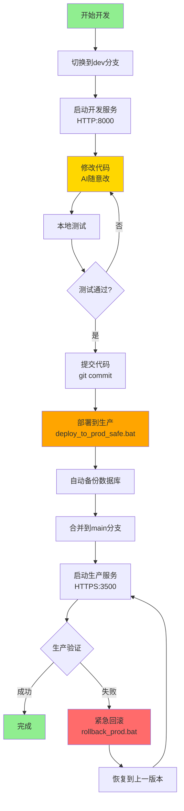

# Git分支环境隔离完整指南

## 📋 方案概述

本方案通过**Git分支管理**实现开发和生产环境的完全隔离，解决了代码共享导致的生产环境风险问题。

### 核心架构

```
项目目录 (同一份代码)
├── Git分支管理
│   ├── dev分支    → 开发环境 (HTTP:8000, db_dev.sqlite3)
│   └── main分支   → 生产环境 (HTTPS:3500, db_prod.sqlite3)
│
├── 环境配置
│   ├── .env.dev   → 开发配置
│   └── .env.prod  → 生产配置
│
└── 数据隔离
    ├── db_dev.sqlite3   → 开发数据
    └── db_prod.sqlite3  → 生产数据
```

---

## 🎯 解决的核心问题

### ✅ 问题1: AI修改代码影响生产环境

**之前的问题:**
```
同一代码目录 → AI改代码 → 立即影响生产环境 ❌
```

**现在的解决方案:**
```
dev分支 (开发)  → AI随意改代码 → 不影响生产 ✅
main分支 (生产) → 稳定版本     → 测试后才合并 ✅
```

### ✅ 问题2: HTTPS证书影响开发效率

**解决方案:**
- 开发环境: HTTP协议 (端口8000), 无需证书
- 生产环境: HTTPS协议 (端口3500), 自签名证书

### ✅ 问题3: 测试数据污染生产数据

**解决方案:**
- 开发数据库: `db_dev.sqlite3`
- 生产数据库: `db_prod.sqlite3`
- 完全隔离,互不影响

---

## 🚀 快速开始

### 初次设置 (已完成)

系统已经为您配置好:
- ✅ Git仓库已初始化
- ✅ dev分支已创建
- ✅ 生产基线标签已创建 (v1.0-prod-baseline)
- ✅ .gitignore已配置 (保护敏感数据)

### 日常开发流程

#### 1️⃣ 开始开发

```bash
# 方式1: 使用脚本 (推荐)
双击 switch_to_dev_branch.bat

# 方式2: 手动命令
git checkout dev
start_dev.bat
```

**访问地址:**
- 本机: http://127.0.0.1:8000
- 局域网: http://10.168.3.240:8000

**优势:**
- ✅ HTTP协议,无证书警告
- ✅ 浏览器开发工具正常
- ✅ AI随意修改代码
- ✅ 不影响生产环境

#### 2️⃣ 提交代码

```bash
# 开发完成后提交
git add .
git commit -m "功能描述: 新增XXX功能"
```

#### 3️⃣ 部署到生产

```bash
# 使用安全部署脚本 (推荐)
双击 deploy_to_prod_safe.bat

# 脚本会自动:
# 1. 检查当前分支
# 2. 停止生产服务
# 3. 备份生产数据库
# 4. 创建代码备份标签
# 5. 合并dev到main
# 6. 执行数据库迁移
# 7. 启动生产服务
```

**访问地址:**
- 本机: https://127.0.0.1:3500
- 局域网: https://10.168.3.240:3500

#### 4️⃣ 紧急回滚

```bash
# 如果生产环境出问题
双击 rollback_prod.bat

# 脚本会:
# 1. 停止生产服务
# 2. 回滚代码到上一版本
# 3. (可选) 恢复数据库备份
# 4. 重启生产服务
```

---

## 📁 文件说明

### 启动脚本

| 文件 | 用途 | 说明 |
|------|------|------|
| [`start_dev.bat`](../start_dev.bat) | 启动开发环境 | HTTP:8000, 使用db_dev.sqlite3 |
| [`start_prod.bat`](../start_prod.bat) | 启动生产环境 | HTTPS:3500, 使用db_prod.sqlite3 |

### Git管理脚本

| 文件 | 用途 | 说明 |
|------|------|------|
| [`switch_to_dev_branch.bat`](../switch_to_dev_branch.bat) | 切换到开发分支 | 自动处理未提交更改 |
| [`switch_to_main_branch.bat`](../switch_to_main_branch.bat) | 切换到生产分支 | 仅用于查看生产代码 |
| [`deploy_to_prod_safe.bat`](../deploy_to_prod_safe.bat) | 安全部署到生产 | 含备份、合并、迁移 |
| [`rollback_prod.bat`](../rollback_prod.bat) | 紧急回滚 | 快速恢复到上一版本 |

### 配置文件

| 文件 | 用途 | 说明 |
|------|------|------|
| [`.env.dev`](../.env.dev) | 开发环境配置 | HTTP, 端口8000 |
| [`.env.prod`](../.env.prod) | 生产环境配置 | HTTPS, 端口3500 |
| [`.gitignore`](../.gitignore) | Git忽略规则 | 保护数据库和敏感配置 |

---

## 🔄 完整工作流程图



---

## 📊 环境对比表

| 特性 | 开发环境 (dev分支) | 生产环境 (main分支) |
|------|-------------------|-------------------|
| **Git分支** | dev | main |
| **协议** | HTTP | HTTPS |
| **端口** | 8000 | 3500 |
| **证书** | ❌ 无 | ✅ 自签名 |
| **数据库** | db_dev.sqlite3 | db_prod.sqlite3 |
| **配置文件** | .env.dev | .env.prod |
| **DEBUG** | True | False |
| **访问范围** | 本机+局域网 | 本机+局域网 |
| **代码修改** | ✅ 随意修改 | ⚠️ 仅合并稳定版本 |
| **用途** | 开发+测试 | 正式使用 |

---

## 🛡️ 安全保障机制

### 1. 代码隔离

```
dev分支修改 → 不影响main分支 → 生产环境安全 ✅
```

### 2. 自动备份

每次部署前自动备份:
- 生产数据库 → `backups/db_prod_时间戳.sqlite3`
- 代码版本 → Git标签 `v-prod-backup-latest`

### 3. 快速回滚

出问题时可以秒级回滚:
- 代码回滚: `git reset --hard v-prod-backup-latest`
- 数据回滚: 从backups目录恢复

### 4. 部署检查

`deploy_to_prod_safe.bat` 会检查:
- ✅ 是否在正确的分支
- ✅ 是否有未提交的更改
- ✅ 数据库备份是否成功
- ✅ 代码合并是否有冲突

---

## 💡 最佳实践

### 开发阶段

1. **始终在dev分支开发**
   ```bash
   git checkout dev
   ```

2. **频繁提交代码**
   ```bash
   git add .
   git commit -m "清晰的提交信息"
   ```

3. **使用HTTP开发**
   - 无证书烦恼
   - 开发效率高

### 部署阶段

1. **使用安全部署脚本**
   ```bash
   deploy_to_prod_safe.bat
   ```

2. **部署后立即验证**
   - 检查关键功能
   - 查看日志输出

3. **保留备份**
   - 定期清理旧备份
   - 保留最近30天

### 回滚阶段

1. **快速决策**
   - 发现问题立即回滚
   - 不要犹豫

2. **记录问题**
   - 记录回滚原因
   - 修复后再部署

---

## 🔧 常见问题

### Q1: 如何查看当前在哪个分支?

```bash
git branch --show-current
```

或者查看终端提示符。

### Q2: dev分支的代码会影响生产环境吗?

**不会!** 只有通过 `deploy_to_prod_safe.bat` 部署后才会影响生产环境。

### Q3: 如果忘记切换分支就修改了代码怎么办?

使用分支切换脚本,它会提示您处理未提交的更改:
- 选项1: 提交更改
- 选项2: 暂存更改 (git stash)
- 选项3: 放弃更改

### Q4: 数据库会自动同步吗?

**不会!** 开发和生产数据库完全独立。

如需同步:
```bash
# 从开发复制到生产 (谨慎!)
copy db_dev.sqlite3 db_prod.sqlite3
```

### Q5: 如何查看备份文件?

```bash
# 打开备份目录
explorer backups

# 或命令行查看
dir backups\db_prod_*.sqlite3 /O-D
```

### Q6: 可以同时运行开发和生产环境吗?

**可以!** 它们使用不同端口:
- 开发: 8000
- 生产: 3500

---

## 📚 Git基础命令参考

### 查看状态

```bash
# 查看当前分支和文件状态
git status

# 查看所有分支
git branch

# 查看提交历史
git log --oneline
```

### 分支操作

```bash
# 切换分支
git checkout dev
git checkout main

# 创建并切换到新分支
git checkout -b feature-xxx
```

### 提交代码

```bash
# 添加所有更改
git add .

# 提交
git commit -m "提交信息"

# 查看未提交的更改
git diff
```

### 标签管理

```bash
# 查看所有标签
git tag

# 创建标签
git tag v1.0

# 删除标签
git tag -d v1.0
```

---

## 🎓 进阶技巧

### 1. 暂存工作区

```bash
# 暂存当前更改
git stash

# 查看暂存列表
git stash list

# 恢复暂存
git stash pop
```

### 2. 查看分支差异

```bash
# 查看dev和main的差异
git diff main..dev
```

### 3. 选择性合并

```bash
# 只合并特定提交
git cherry-pick <commit-hash>
```

### 4. 创建功能分支

```bash
# 从dev创建功能分支
git checkout dev
git checkout -b feature-new-function

# 开发完成后合并回dev
git checkout dev
git merge feature-new-function
```

---

## 📞 技术支持

### 遇到问题时的排查步骤

1. **查看当前分支**
   ```bash
   git branch --show-current
   ```

2. **查看文件状态**
   ```bash
   git status
   ```

3. **查看最近的提交**
   ```bash
   git log --oneline -5
   ```

4. **查看备份**
   ```bash
   dir backups
   git tag
   ```

### 紧急情况处理

**情况1: 代码改乱了**
```bash
# 放弃所有未提交的更改
git checkout -- .
```

**情况2: 提交错了**
```bash
# 撤销最后一次提交(保留更改)
git reset --soft HEAD~1
```

**情况3: 分支搞混了**
```bash
# 查看所有分支
git branch -a

# 强制切换到正确分支
git checkout -f dev
```

---

## 📅 维护建议

### 每日

- ✅ 在dev分支开发
- ✅ 频繁提交代码
- ✅ 使用HTTP开发环境

### 每周

- ✅ 清理旧的数据库备份
- ✅ 检查Git仓库大小
- ✅ 验证生产环境状态

### 每月

- ✅ 创建生产版本标签 (v1.1, v1.2...)
- ✅ 归档重要备份
- ✅ 更新文档

---

## 🎉 总结

### 核心优势

1. **代码安全**: dev分支随意改,不影响生产
2. **开发便捷**: HTTP协议,无证书烦恼
3. **数据隔离**: 独立数据库,互不影响
4. **快速回滚**: 出问题秒级恢复
5. **专业规范**: 符合行业最佳实践

### 工作流程

```
开发 (dev分支, HTTP:8000)
  ↓
测试通过
  ↓
部署 (deploy_to_prod_safe.bat)
  ↓
生产环境 (main分支, HTTPS:3500)
  ↓
验证成功 ✅ 或 回滚 ↩️
```

---

**文档版本**: v1.0  
**最后更新**: 2025-11-11  
**维护者**: 系统管理员