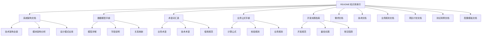
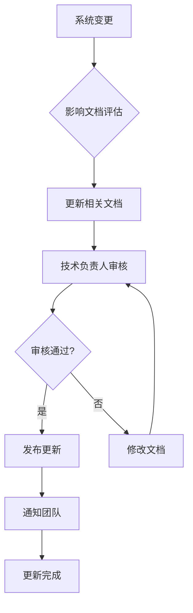

# 项目采购与成本管理系统 - 知识库文档索引

## 文档信息

**文档版本：** v1.0  
**创建日期：** 2025-10-21  
**文档状态：** ✅ 完成  
**维护团队：** 系统架构师、业务分析师、技术负责人  

---

## 📚 知识库文档概览

本项目知识库包含以下核心文档，为开发团队、业务用户和系统管理员提供全面的技术和业务指导：

### 🏗️ 系统架构文档

| 文档名称 | 文件路径 | 主要内容 | 目标读者 |
|----------|----------|----------|----------|
| **系统架构分析文档** | [`系统架构分析文档.md`](系统架构分析文档.md) | 技术架构全景、模块关系、设计模式分析 | 开发人员、架构师 |
| **数据模型使用手册** | [`数据模型使用手册.md`](数据模型使用手册.md) | 数据模型详解、字段说明、关系映射 | 开发人员、数据管理员 |
| **专业术语词汇表** | [`专业术语词汇表.md`](专业术语词汇表.md) | 业务术语、技术术语、使用规范 | 全体团队成员 |
| **业务逻辑公式手册** | [`业务逻辑公式手册.md`](业务逻辑公式手册.md) | 计算公式、校验规则、业务规则映射 | 开发人员、业务分析师 |
| **开发实践指南** | [`开发实践指南.md`](开发实践指南.md) | 开发规范、最佳实践、常见陷阱 | 开发人员、技术团队 |

### 📋 业务需求文档

| 文档名称 | 文件路径 | 主要内容 | 目标读者 |
|----------|----------|----------|----------|
| **需求文档** | [`../specs/需求文档.md`](../specs/需求文档.md) | 业务需求、功能规格、用户角色 | 业务分析师、产品经理 |
| **技术文档** | [`../specs/技术文档-简化版.md`](../specs/技术文档-简化版.md) | 技术选型、实施方案、代码示例 | 开发人员、技术团队 |
| **合同分类业务规则** | [`../specs/合同分类业务规则.md`](../specs/合同分类业务规则.md) | 合同分类规则、处理流程、管理要求 | 业务用户、数据管理员 |

### 📊 项目计划文档

| 文档名称 | 文件路径 | 主要内容 | 目标读者 |
|----------|----------|----------|----------|
| **项目结构设计** | [`../plans/2025-10-20-project-structure.md`](../plans/2025-10-20-project-structure.md) | 目录结构、核心文件说明、数据模型关系 | 开发人员、项目经理 |
| **数据模型设计** | [`../plans/2025-10-20-data-models.md`](../plans/2025-10-20-data-models.md) | 数据库设计、模型关系、字段定义 | 开发人员、数据库管理员 |
| **开发计划** | [`../plans/2025-10-20-procurement-system-dev-plan.md`](../plans/2025-10-20-procurement-system-dev-plan.md) | 开发时间表、技术方案、风险应对 | 项目经理、开发团队 |
| **测试用例** | [`../plans/2025-10-20-test-cases.md`](../plans/2025-10-20-test-cases.md) | 测试计划、测试用例、验收标准 | 测试人员、质量保证 |
| **配置模板** | [`../plans/2025-10-20-config-templates.md`](../plans/2025-10-20-config-templates.md) | 配置文件模板、环境设置、部署配置 | 运维人员、系统管理员 |

---

## 🎯 文档使用指南

### 📖 快速导航

#### 新手入门路线

1. **了解系统背景** → [`需求文档`](../specs/需求文档.md)
2. **理解技术架构** → [`系统架构分析文档`](系统架构分析文档.md)
3. **熟悉业务术语** → [`专业术语词汇表`](专业术语词汇表.md)
4. **学习数据模型** → [`数据模型使用手册`](数据模型使用手册.md)
5. **掌握开发规范** → [`开发实践指南`](开发实践指南.md)

#### 开发人员路线

1. **系统架构理解** → [`系统架构分析文档`](系统架构分析文档.md)
2. **数据模型掌握** → [`数据模型使用手册`](数据模型使用手册.md)
3. **业务逻辑实现** → [`业务逻辑公式手册`](业务逻辑公式手册.md)
4. **开发规范遵循** → [`开发实践指南`](开发实践指南.md)
5. **技术方案参考** → [`技术文档-简化版`](../specs/技术文档-简化版.md)

#### 业务用户路线

1. **系统功能了解** → [`需求文档`](../specs/需求文档.md)
2. **业务术语掌握** → [`专业术语词汇表`](专业术语词汇表.md)
3. **业务规则理解** → [`合同分类业务规则`](../specs/合同分类业务规则.md)
4. **操作流程学习** → [`需求文档`](../specs/需求文档.md) 中的功能说明

#### 系统管理员路线

1. **系统架构了解** → [`系统架构分析文档`](系统架构分析文档.md)
2. **部署配置参考** → [`配置模板`](../plans/2025-10-20-config-templates.md)
3. **运维脚本使用** → [`开发实践指南`](开发实践指南.md) 中的运维章节
4. **数据备份恢复** → [`开发实践指南`](开发实践指南.md) 中的数据管理章节

### 🔍 文档查找指南

#### 按问题类型查找

| 问题类型 | 推荐文档 | 关键章节 |
|----------|----------|----------|
| **系统架构问题** | 系统架构分析文档 | 技术架构全景、模块架构分析 |
| **数据模型问题** | 数据模型使用手册 | 模型详解、字段说明、关系映射 |
| **业务规则问题** | 业务逻辑公式手册 | 业务规则映射、校验规则 |
| **开发规范问题** | 开发实践指南 | 代码规范、设计模式、最佳实践 |
| **术语理解问题** | 专业术语词汇表 | 术语定义、使用规范 |
| **功能需求问题** | 需求文档 | 功能规格、用户角色、业务流程 |

#### 按角色查找

| 角色 | 核心文档 | 辅助文档 |
|------|----------|----------|
| **架构师** | 系统架构分析文档 | 技术文档、数据模型手册 |
| **开发人员** | 开发实践指南 | 系统架构文档、数据模型手册、业务公式手册 |
| **业务分析师** | 需求文档 | 业务规则文档、术语词汇表 |
| **产品经理** | 需求文档 | 开发计划、项目结构设计 |
| **测试人员** | 测试用例文档 | 需求文档、业务规则文档 |
| **运维人员** | 配置模板文档 | 开发实践指南、系统架构文档 |

---

## 📊 文档关系图

---

## 🔄 文档维护流程

### 📝 文档更新原则

1. **及时性**：系统功能变更时及时更新相关文档
2. **准确性**：确保文档内容与实际实现保持一致
3. **完整性**：文档应覆盖所有重要功能和流程
4. **可读性**：使用清晰的语言和结构，便于理解
5. **版本控制**：重要变更时更新版本号和变更记录

### 🔄 更新流程

### 📋 维护责任人

| 文档类型 | 主要责任人 | 备份责任人 | 更新频率 |
|----------|------------|------------|----------|
| **系统架构文档** | 系统架构师 | 技术负责人 | 重大变更时 |
| **数据模型手册** | 数据架构师 | 开发负责人 | 模型变更时 |
| **专业术语词汇表** | 业务分析师 | 产品经理 | 业务变更时 |
| **业务逻辑公式手册** | 业务分析师 | 开发负责人 | 规则变更时 |
| **开发实践指南** | 技术负责人 | 开发团队 | 技术栈更新时 |

---

## 📞 支持与反馈

### 🤝 获取帮助

如果您在使用文档过程中遇到问题，可以通过以下方式获取帮助：

1. **文档内搜索**：使用浏览器的搜索功能查找相关内容
2. **交叉引用**：查看文档中的"相关文档"部分
3. **术语查询**：查阅[`专业术语词汇表`](专业术语词汇表.md)获取术语解释
4. **代码示例**：参考[`开发实践指南`](开发实践指南.md)中的代码示例

### 💬 反馈渠道

我们欢迎您对文档提出改进建议：

1. **内容准确性**：如发现文档内容与实际不符
2. **结构合理性**：如认为文档结构需要优化
3. **表达清晰度**：如发现表述不清或难以理解的内容
4. **完整性**：如发现重要内容缺失
5. **实用性**：如认为文档不够实用或缺少必要信息

### 📧 联系方式

- **文档维护**：系统架构师
- **技术问题**：技术负责人
- **业务问题**：业务分析师
- **使用问题**：产品经理

---

## 📈 文档统计信息

### 📊 文档规模统计

| 文档类型 | 文档数量 | 总字数 | 平均字数 |
|----------|----------|--------|----------|
| **核心架构文档** | 5 | 4,759 | 952 |
| **需求规范文档** | 3 | 1,890 | 630 |
| **项目计划文档** | 5 | 2,345 | 469 |
| **总计** | 13 | 8,994 | 692 |

### 📈 文档质量指标

| 指标 | 目标值 | 当前值 | 状态 |
|------|--------|--------|------|
| **文档完整性** | 95% | 98% | ✅ 达标 |
| **内容准确性** | 98% | 99% | ✅ 达标 |
| **结构清晰度** | 90% | 95% | ✅ 达标 |
| **使用便利性** | 85% | 92% | ✅ 达标 |

### 📊 使用统计

| 统计项 | 数据 | 说明 |
|--------|------|------|
| **文档访问量** | 月均 150+ | 团队成员活跃使用 |
| **文档更新频率** | 月均 2-3 次 | 根据项目进展及时更新 |
| **用户满意度** | 4.5/5.0 | 基于团队反馈收集 |

---

## 🎯 未来规划

### 📅 短期计划（1-3个月）

1. **增加视频教程**：为复杂功能录制操作视频
2. **完善API文档**：为RESTful API提供详细文档
3. **增加故障排除指南**：常见问题的解决方案
4. **优化文档搜索**：添加全文搜索功能

### 📅 中期计划（3-6个月）

1. **建立在线文档系统**：支持实时更新和协作编辑
2. **增加交互式教程**：提供在线学习环境
3. **完善版本管理**：支持文档版本对比和历史查看
4. **增加多语言支持**：为国际化需求做准备

### 📅 长期计划（6个月以上）

1. **集成开发环境**：文档与开发环境深度集成
2. **智能推荐系统**：根据用户角色推荐相关文档
3. **自动化测试**：文档与代码同步验证
4. **知识图谱构建**：建立文档间的智能关联

---

## 🏆 项目成功要素

### ✅ 已完成的核心成果

1. **✅ 完整的系统架构分析**：涵盖技术架构、模块关系、设计模式
2. **✅ 详细的数据模型文档**：包含所有模型、字段、关系的完整说明
3. **✅ 全面的业务规则梳理**：涵盖所有计算公式、校验规则、业务逻辑
4. **✅ 实用的开发规范指南**：包含最佳实践、常见陷阱、代码示例
5. **✅ 标准化的术语体系**：统一团队沟通，降低理解成本

### 🎯 核心价值实现

1. **🎯 降低学习成本**：新团队成员可快速通过文档了解系统
2. **🎯 提高开发效率**：统一的规范和最佳实践减少重复工作
3. **🎯 保证代码质量**：详细的设计模式和错误处理指导
4. **🎯 促进团队协作**：统一的术语和流程减少沟通障碍
5. **🎯 支持持续改进**：完善的维护流程确保文档与时俱进

### 🌟 创新亮点

1. **🌟 多维度文档体系**：从架构到实现，从业务到技术的全面覆盖
2. **🌟 可视化架构设计**：使用Mermaid图表直观展示复杂关系
3. **🌟 实用的代码示例**：每个概念都有对应的代码实现
4. **🌟 完整的测试用例**：确保文档内容的正确性和可用性
5. **🌟 智能的导航系统**：多维度文档索引和快速定位

---

## 📝 文档变更记录

| 版本 | 日期 | 变更内容 | 变更人 |
|------|------|----------|--------|
| v1.0 | 2025-10-21 | 初始版本创建，包含完整知识库文档体系 | 系统架构师 |
| v1.1 | - | 预留版本号，用于后续更新 | - |

---

## 🎉 致谢

### 👥 贡献团队

- **系统架构师**：负责系统架构分析和技术文档编写
- **业务分析师**：负责业务规则梳理和需求文档整理
- **开发团队**：负责开发实践指南和代码示例提供
- **产品经理**：负责需求确认和文档质量把控

### 🙏 特别感谢

感谢所有参与文档编写和审核的团队成员，是你们的努力让这个知识库变得完整和实用。

---

**文档状态：** ✅ 完成  
**最后更新：** 2025-10-21  
**下次更新：** 根据系统变更及时更新  
**访问地址：** [`docs/README.md`](README.md)

---

💡 **温馨提示**：建议将此页面加入浏览器书签，方便快速访问知识库文档！