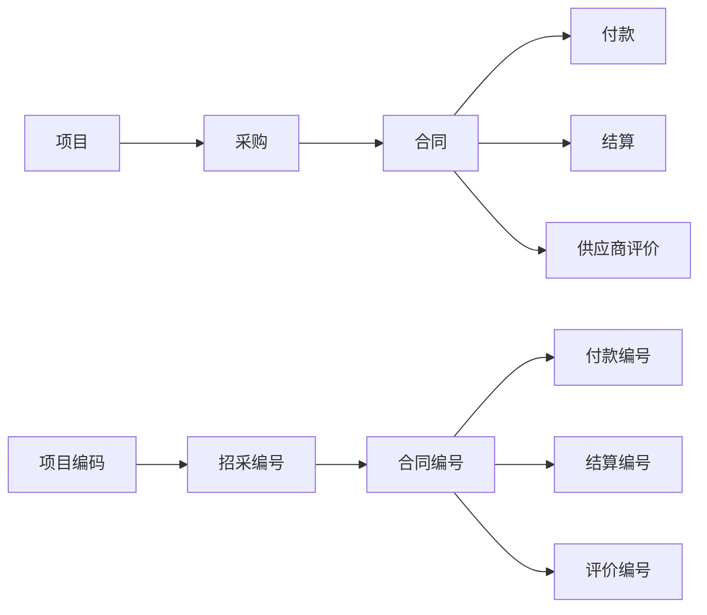
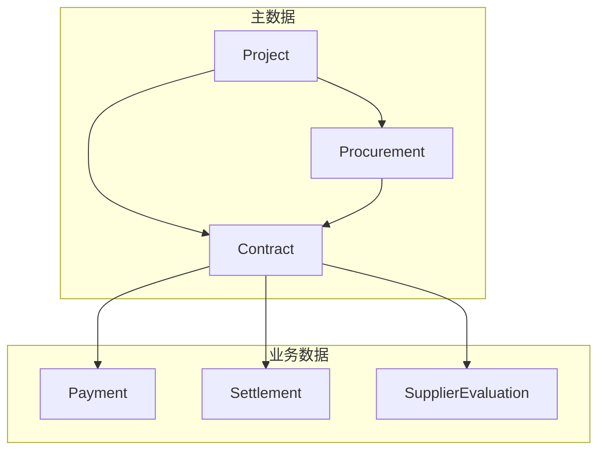

# 项目采购与成本管理系统 - 专业术语词汇表

## 文档信息

**文档版本：** v1.0  
**创建日期：** 2025-10-21  
**术语来源：** 系统代码、业务文档、用户界面  
**适用范围：** 开发人员、业务用户、系统管理员  

---

## 1. 核心业务术语

### 1.1 项目管理相关

| 术语 | 英文对照 | 定义 | 使用场景 | 代码位置 |
|------|----------|------|----------|----------|
| **项目编码** | Project Code | 项目的唯一标识符，格式如 `PRJ2025001` | 项目创建、查询、关联 | [`project.models.Project.project_code`](project/models.py:8) |
| **项目名称** | Project Name | 项目的正式名称，用于业务识别 | 项目列表、详情展示 | [`project.models.Project.project_name`](project/models.py:16) |
| **项目负责人** | Project Manager | 负责该项目的管理人员 | 项目管理、权限分配 | [`project.models.Project.project_manager`](project/models.py:29) |
| **项目状态** | Project Status | 项目当前所处状态（进行中/已完成/已暂停/已取消） | 项目筛选、状态跟踪 | [`project.models.Project.status`](project/models.py:36) |

### 1.2 采购管理相关

| 术语 | 英文对照 | 定义 | 使用场景 | 代码位置 |
|------|----------|------|----------|----------|
| **招采编号** | Procurement Code | 采购项目的唯一标识符，格式如 `GC2025001` | 采购创建、查询、关联合同 | [`procurement.models.Procurement.procurement_code`](procurement/models.py:48) |
| **采购名称** | Procurement Name | 采购项目的正式名称 | 采购列表、详情展示 | [`procurement.models.Procurement.project_name`](procurement/models.py:67) |
| **采购单位** | Procurement Unit | 发起采购的部门或单位 | 采购信息记录、统计分析 | [`procurement.models.Procurement.procurement_unit`](procurement/models.py:75) |
| **中标人** | Winning Bidder | 最终中标的供应商 | 采购结果记录、合同关联 | [`procurement.models.Procurement.winning_bidder`](procurement/models.py:211) |
| **中标价** | Winning Amount | 最终中标的价格 | 采购结果分析、成本控制 | [`procurement.models.Procurement.winning_amount`](procurement/models.py:137) |
| **预算金额** | Budget Amount | 项目的预算控制金额 | 预算管理、成本分析 | [`procurement.models.Procurement.budget_amount`](procurement/models.py:119) |
| **采购控制价** | Control Price | 采购的价格上限 | 价格控制、招标管理 | [`procurement.models.Procurement.control_price`](procurement/models.py:128) |
| **开标日期** | Bid Opening Date | 正式开标的日期 | 采购进度跟踪、时间管理 | [`procurement.models.Procurement.bid_opening_date`](procurement/models.py:176) |
| **采购平台** | Procurement Platform | 进行采购活动的平台名称 | 采购过程记录、平台分析 | [`procurement.models.Procurement.procurement_platform`](procurement/models.py:147) |
| **采购方式** | Procurement Method | 采购采用的方式，包括法定方式和扩展方式共9种 | 采购方式统计、流程管理 | [`procurement.models.Procurement.procurement_method`](procurement/models.py:154) |
| **评标方法** | Bid Evaluation Method | 评标采用的方法（综合评分法/最低价法等） | 评标过程记录、方法分析 | [`procurement.models.Procurement.bid_evaluation_method`](procurement/models.py:161) |
| **定标方法** | Bid Awarding Method | 确定中标人的方法 | 定标过程记录、决策分析 | [`procurement.models.Procurement.bid_awarding_method`](procurement/models.py:168) |
| **投标担保** | Bid Guarantee | 投标时提供的担保形式及金额 | 担保管理、风险控制 | [`procurement.models.Procurement.bid_guarantee`](procurement/models.py:226) |
| **履约担保** | Performance Guarantee | 合同履行期间的担保形式及金额 | 担保管理、风险控制 | [`procurement.models.Procurement.performance_guarantee`](procurement/models.py:240) |

### 1.2.1 采购方式详解

系统支持9种采购方式，包括6种法定采购方式和3种扩展采购方式：

| 术语 | 类型 | 适用场景 | 特点 | 法律依据 |
|------|------|----------|------|----------|
| **公开招标** | 法定 | 大额政府采购项目 | 公开发布公告，资格合格的供应商均可参加 | 《政府采购法》第二十六条 |
| **邀请招标** | 法定 | 技术复杂或特殊要求的项目 | 邀请特定供应商参加投标 | 《政府采购法》第二十六条 |
| **竞争性谈判** | 法定 | 招标失败或技术复杂项目 | 与多家供应商谈判，综合比较后确定 | 《政府采购法》第三十条 |
| **竞争性磋商** | 法定 | 政府购买服务、技术复杂项目 | 多轮磋商，不断完善需求和方案 | 财库〔2014〕214号 |
| **单一来源采购** | 法定 | 唯一供应商或紧急情况 | 直接从特定供应商处采购 | 《政府采购法》第三十一条 |
| **询价采购** | 法定 | 规格统一、货源充足的货物 | 向多家供应商询价，选择最低报价 | 《政府采购法》第三十二条 |
| **直接采购** | 扩展 | 小额零星采购、紧急物资 | 简化流程，不需公开招标程序 | 企业内部制度 |
| **竞价采购** | 扩展 | 标准化商品、电子化平台 | 实时竞价，动态调整价格，透明高效 | 电子商务采购规则 |
| **比选** | 扩展 | 国际组织贷款项目、咨询服务 | 介于招标和询价之间，程序相对简化 | 国际组织贷款规则 |

**使用说明**：
- 系统中的"采购方式"字段为自由文本，不强制约束
- 建议使用上述9种标准名称之一，以便统计和分析
- 历史数据可保留原有名称（如"招标"、"谈判采购"等）
- 详细规范参见：[`specs/采购方式扩展规范.md`](specs/采购方式扩展规范.md)

### 1.3 合同管理相关

| 术语 | 英文对照 | 定义 | 使用场景 | 代码位置 |
|------|----------|------|----------|----------|
| **合同编号** | Contract Code | 合同的唯一标识符，格式如 `HT2025001` | 合同创建、查询、关联 | [`contract.models.Contract.contract_code`](contract/models.py:13) |
| **合同序号** | Contract Sequence | 合同的序号，支持字符串格式如 `BHHY-NH-001` | 合同排序、关联查找 | [`contract.models.Contract.contract_sequence`](contract/models.py:87) |
| **合同名称** | Contract Name | 合同的正式名称 | 合同列表、详情展示 | [`contract.models.Contract.contract_name`](contract/models.py:32) |
| **合同类型** | Contract Type | 合同的分类（主合同/补充协议/解除协议） | 合同分类、业务规则 | [`contract.models.Contract.contract_type`](contract/models.py:40) |
| **合同来源** | Contract Source | 合同的来源分类（采购合同/直接签订） | 业务规则、统计分析 | [`contract.models.Contract.contract_source`](contract/models.py:54) |
| **主合同** | Main Contract | 独立的原始合同，可关联补充协议 | 合同关系管理、业务规则 | [`contract.models.Contract.contract_type`](contract/models.py:40) |
| **补充协议** | Supplementary Agreement | 对主合同的补充约定 | 合同关系管理、金额累计 | [`contract.models.Contract.contract_type`](contract/models.py:40) |
| **解除协议** | Termination Agreement | 解除原合同的协议 | 合同关系管理、状态变更 | [`contract.models.Contract.contract_type`](contract/models.py:40) |
| **关联主合同** | Parent Contract | 补充协议关联的主合同 | 合同关系建立、数据继承 | [`contract.models.Contract.parent_contract`](contract/models.py:66) |
| **关联采购编号** | Related Procurement Code | 合同关联的采购项目编号 | 采购合同验证、业务关联 | [`contract.models.Contract.procurement`](contract/models.py:76) |
| **甲方** | Party A | 合同中的第一方（通常为我司） | 合同方信息、签约管理 | [`contract.models.Contract.party_a`](contract/models.py:96) |
| **乙方** | Party B | 合同中的第二方（供应商） | 合同方信息、供应商管理 | [`contract.models.Contract.party_b`](contract/models.py:103) |
| **含税签约合同价** | Contract Amount | 签订时的合同总价（含税） | 金额统计、付款计算 | [`contract.models.Contract.contract_amount`](contract/models.py:125) |
| **合同签订日期** | Signing Date | 合同正式签署的日期 | 时间管理、统计分析 | [`contract.models.Contract.signing_date`](contract/models.py:134) |
| **合同工期/服务期限** | Duration | 合同的执行期限或服务期限 | 履约管理、时间跟踪 | [`contract.models.Contract.duration`](contract/models.py:142) |
| **支付方式** | Payment Method | 合同约定的付款方式 | 付款管理、财务计划 | [`contract.models.Contract.payment_method`](contract/models.py:156) |

### 1.4 付款管理相关

| 术语 | 英文对照 | 定义 | 使用场景 | 代码位置 |
|------|----------|------|----------|----------|
| **付款编号** | Payment Code | 付款记录的唯一标识符，格式如 `HT2025001-FK-001` | 付款创建、查询、跟踪 | [`payment.models.Payment.payment_code`](payment/models.py:13) |
| **实付金额** | Payment Amount | 本次实际支付的金额 | 付款记录、财务统计 | [`payment.models.Payment.payment_amount`](payment/models.py:31) |
| **付款日期** | Payment Date | 实际支付的日期 | 付款排序、时间统计 | [`payment.models.Payment.payment_date`](payment/models.py:38) |
| **结算价** | Settlement Amount | 合同的最终结算价格 | 结算管理、金额计算 | [`payment.models.Payment.settlement_amount`](payment/models.py:45) |
| **是否办理结算** | Is Settled | 标识该笔付款是否已办理结算 | 结算状态跟踪、业务判断 | [`payment.models.Payment.is_settled`](payment/models.py:54) |
| **累计付款金额** | Total Paid Amount | 合同的累计付款总额 | 付款进度计算、财务分析 | [`contract.models.Contract.get_total_paid_amount()`](contract/models.py:220) |
| **付款比例** | Payment Ratio | 累计付款占合同金额的比例 | 付款进度跟踪、风险预警 | [`contract.models.Contract.get_payment_ratio()`](contract/models.py:230) |

### 1.5 结算管理相关

| 术语 | 英文对照 | 定义 | 使用场景 | 代码位置 |
|------|----------|------|----------|----------|
| **结算编号** | Settlement Code | 结算记录的唯一标识符，格式如 `JS2025001` | 结算创建、查询、跟踪 | [`settlement.models.Settlement.settlement_code`](settlement/models.py:13) |
| **最终结算金额** | Final Amount | 主合同+所有补充协议的累计最终结算金额 | 结算金额、财务统计 | [`settlement.models.Settlement.final_amount`](settlement/models.py:31) |
| **完成日期** | Completion Date | 结算完成的日期 | 结算时间管理、进度跟踪 | [`settlement.models.Settlement.completion_date`](settlement/models.py:38) |
| **主合同+补充协议总金额** | Total Contract Amount | 主合同及所有补充协议的金额总和 | 结算基准、金额计算 | [`settlement.models.Settlement.get_total_contract_amount()`](settlement/models.py:72) |

### 1.6 供应商评价相关

| 术语 | 英文对照 | 定义 | 使用场景 | 代码位置 |
|------|----------|------|----------|----------|
| **评价编号** | Evaluation Code | 评价记录的唯一标识符，格式如 `PJ2025001-001` | 评价创建、查询、跟踪 | [`supplier_eval.models.SupplierEvaluation.evaluation_code`](supplier_eval/models.py:12) |
| **供应商名称** | Supplier Name | 被评价的供应商名称 | 供应商管理、评价记录 | [`supplier_eval.models.SupplierEvaluation.supplier_name`](supplier_eval/models.py:29) |
| **评价日期区间** | Evaluation Period | 评价覆盖的时间范围 | 评价时间管理、统计分析 | [`supplier_eval.models.SupplierEvaluation.evaluation_period`](supplier_eval/models.py:36) |
| **评价人员** | Evaluator | 填写评价的人员名称 | 责任追踪、评价管理 | [`supplier_eval.models.SupplierEvaluation.evaluator`](supplier_eval/models.py:43) |
| **评分** | Score | 对供应商的评价分数（满分100分） | 供应商考核、质量评估 | [`supplier_eval.models.SupplierEvaluation.score`](supplier_eval/models.py:50) |
| **评价类型** | Evaluation Type | 评价的分类（末次评价/履约过程评价） | 评价分类、统计分析 | [`supplier_eval.models.SupplierEvaluation.evaluation_type`](supplier_eval/models.py:59) |
| **末次评价** | Final Evaluation | 合同履行完成后的最终评价 | 合同总结、供应商认证 | [`supplier_eval.models.SupplierEvaluation.evaluation_type`](supplier_eval/models.py:59) |
| **履约过程评价** | Process Evaluation | 合同履行过程中的阶段性评价 | 过程监控、改进指导 | [`supplier_eval.models.SupplierEvaluation.evaluation_type`](supplier_eval/models.py:59) |

### 1.7 监控管理相关

| 术语 | 英文对照 | 定义 | 使用场景 | 代码位置 |
|------|----------|------|----------|----------|
| **监控驾驶舱** | Monitoring Cockpit | 监控中心的综合展示页面，汇总显示各类监控指标 | 监控首页、全局概览 | [`project/views.py:monitoring_cockpit`](project/views.py) |
| **归档监控** | Archive Monitoring | 对采购、合同、结算等资料归档情况的监控管理 | 归档统计、逾期预警 | [`project/services/archive_monitor.py:ArchiveMonitorService`](project/services/archive_monitor.py:9) |
| **更新监控** | Update Monitoring | 对采购、合同等信息更新情况的监控管理 | 更新统计、进度跟踪 | [`project/services/update_monitor.py:UpdateMonitorService`](project/services/update_monitor.py:9) |
| **完整性检查** | Completeness Check | 对各模块数据字段填写完整性的检查 | 数据质量评估、完整性分析 | [`project/services/completeness.py`](project/services/completeness.py:12) |
| **项目归档表现** | Project Archive Performance | 各项目在归档完成率和及时率方面的综合表现 | 项目排行、绩效评估 | [`project/services/archive_monitor.py:get_project_archive_performance()`](project/services/archive_monitor.py:332) |
| **字段齐全性** | Field Completeness | 数据记录中必填字段的填写完整程度 | 数据质量评估、查缺补漏 | [`project/services/completeness.py:check_procurement_field_completeness()`](project/services/completeness.py:15) |
| **项目排行榜** | Project Ranking | 按项目维度对各项指标进行排名 | 绩效展示、对比分析 | [`project/services/completeness.py:get_project_completeness_ranking()`](project/services/completeness.py:580) |
| **资料归档** | Document Archive | 采购、合同、结算等资料的归档操作和记录 | 档案管理、合规要求 | [`procurement/models.py:Procurement.archive_date`](procurement/models.py:220) |
| **归档日期** | Archive Date | 资料实际完成归档的日期 | 归档统计、时间管理 | [`procurement/models.py:Procurement.archive_date`](procurement/models.py:220) |
| **文件定位** | File Positioning | 区分合同类型：主合同、补充协议、解除协议 | 合同分类、归档管理 | [`contract/models.py:Contract.file_positioning`](contract/models.py:77) |
| **归档及时率** | Archive Timeliness Rate | 在规定时间内完成归档的比率 | 绩效评估、质量监控 | [`project/services/archive_monitor.py`](project/services/archive_monitor.py:222) |
| **采购周期分析** | Procurement Cycle Analysis | 按采购方式对采购周期进行的统计分析 | 流程优化、时间管理 | [`project/services/statistics.py:get_procurement_statistics()`](project/services/statistics.py:98) |
| **采购偏差分析** | Procurement Deviation Analysis | 对预算与实际支出偏差的Top 5分析 | 成本控制、风险预警 | [`project/services/statistics.py`](project/services/statistics.py:145) |
| **项目齐全率** | Project Completeness Rate | 项目内所有记录字段填写的平均完整度 | 数据质量评估、排名统计 | [`project/services/completeness.py:get_project_completeness_ranking()`](project/services/completeness.py:580) |
| **统一年份解析** | Unified Year Resolution | 监控页面统一处理年份筛选的函数 | 筛选优化、代码复用 | [`project/filter_config.py:resolve_monitoring_year()`](project/filter_config.py:606) |
| **年份筛选上下文** | Year Filter Context | 包含当前年份、可用年份、选择值的上下文对象 | 参数传递、状态管理 | [`project/filter_config.py:get_monitoring_filter_config()`](project/filter_config.py:637) |

### 1.8 统计报表相关

| 术语 | 英文对照 | 定义 | 使用场景 | 代码位置 |
|------|----------|------|----------|----------|
| **报表生成器** | Report Generator | 通用报表生成基类，支持多种时间维度 | 周报、月报、季报、年报 | [`project/services/report_generator.py:BaseReportGenerator`](project/services/report_generator.py:18) |
| **周报生成器** | Weekly Report Generator | 生成周度统计报表的专用类 | 周度总结、短期分析 | [`project/services/report_generator.py:WeeklyReportGenerator`](project/services/report_generator.py:180) |
| **月报生成器** | Monthly Report Generator | 生成月度统计报表的专用类 | 月度总结、中期分析 | [`project/services/report_generator.py:MonthlyReportGenerator`](project/services/report_generator.py:209) |
| **季报生成器** | Quarterly Report Generator | 生成季度统计报表的专用类 | 季度总结、长期分析 | [`project/services/report_generator.py:QuarterlyReportGenerator`](project/services/report_generator.py:247) |
| **年报生成器** | Annual Report Generator | 生成年度统计报表的专用类 | 年度总结、战略分析 | [`project/services/report_generator.py:AnnualReportGenerator`](project/services/report_generator.py:278) |
| **项目筛选参数** | Project Filter Parameter | 报表生成时可按项目编码进行筛选 | 多项目分析、专项报表 | [`project/services/report_generator.py:BaseReportGenerator.__init__()`](project/services/report_generator.py:28) |

---

## 2. 技术术语

### 2.1 系统架构相关

| 术语 | 英文对照 | 定义 | 使用场景 | 代码位置 |
|------|----------|------|----------|----------|
| **Django Admin** | Django Admin | Django内置的管理后台界面 | 系统管理、数据操作 | [`config/admin.py`](config/admin.py) |
| **SQLite** | SQLite | 轻量级文件数据库，零配置 | 数据存储、备份恢复 | [`config/settings.py:DATABASES`](config/settings.py:70) |
| **BaseModel** | Base Model | 抽象基类，包含通用审计字段 | 代码复用、一致性 | [`procurement/models.py:BaseModel`](procurement/models.py:8) |
| **外键约束** | Foreign Key Constraint | 数据库层面的引用完整性约束 | 数据一致性、关系维护 | 各模型的ForeignKey字段 |
| **一对一关系** | One-to-One Relationship | 两个实体间的唯一对应关系 | 结算与合同的关系 | [`settlement.models.Settlement.main_contract`](settlement/models.py:21) |
| **事务** | Transaction | 数据库操作的原子性保证 | 数据一致性、错误恢复 | [`procurement/management/commands/import_excel.py:253`](procurement/management/commands/import_excel.py:253) |

### 2.2 数据处理相关

| 术语 | 英文对照 | 定义 | 使用场景 | 代码位置 |
|------|----------|------|----------|----------|
| **长表格式** | Long Table | 标准的行式数据格式，每行一条记录 | 标准数据导入、日常录入 | [`procurement/management/commands/import_excel.py:221`](procurement/management/commands/import_excel.py:221) |
| **宽表格式** | Wide Table | 列式数据格式，时间维度展开为列 | 历史数据导入、Excel转换 | [`procurement/management/commands/import_excel.py:402`](procurement/management/commands/import_excel.py:402) |
| **逆透视** | Unpivot/Melt | 将宽表转换为长表的数据操作 | 数据格式转换、历史数据处理 | [`procurement/management/commands/import_excel.py:544`](procurement/management/commands/import_excel.py:544) |
| **编码检测** | Encoding Detection | 自动识别文件编码格式 | Excel导入、中文支持 | [`procurement/management/commands/import_excel.py:184`](procurement/management/commands/import_excel.py:184) |
| **批量导入** | Batch Import | 一次性导入大量数据的操作 | 数据迁移、初始化 | [`procurement/management/commands/import_excel.py`](procurement/management/commands/import_excel.py) |
| **冲突处理** | Conflict Resolution | 处理数据重复或冲突的策略 | 数据导入、更新策略 | [`procurement/management/commands/import_excel.py:64`](procurement/management/commands/import_excel.py:64) |

### 2.3 开发相关

| 术语 | 英文对照 | 定义 | 使用场景 | 代码位置 |
|------|----------|------|----------|----------|
| **迁移文件** | Migration File | Django数据库结构变更的记录文件 | 数据库版本管理、结构变更 | 各应用的migrations目录 |
| **管理命令** | Management Command | Django的自定义命令行工具 | 数据导入、系统维护 | [`procurement/management/commands/`](procurement/management/commands/) |
| **视图函数** | View Function | 处理HTTP请求的Python函数 | 业务逻辑、页面渲染 | [`project/views.py`](project/views.py) |
| **模板** | Template | HTML页面模板，支持Django模板语法 | 页面展示、用户界面 | [`project/templates/`](project/templates/) |
| **静态文件** | Static Files | CSS、JavaScript、图片等静态资源 | 页面样式、交互功能 | `static/` 目录 |

---

## 3. 业务规则术语

### 3.1 数据验证规则

| 术语 | 英文对照 | 定义 | 规则描述 | 代码位置 |
|------|----------|------|----------|----------|
| **采购合同必须关联采购** | Procurement Contract Must Link Procurement | 采购合同类型的合同必须关联采购项目 | 业务规则验证、数据完整性 | [`contract/models.py:Contract.clean()`](contract/models.py:198) |
| **直接签订不能关联采购** | Direct Contract Cannot Link Procurement | 直接签订类型的合同不能关联采购项目 | 业务规则验证、逻辑一致性 | [`contract/models.py:Contract.clean()`](contract/models.py:202) |
| **补充协议必须关联主合同** | Supplement Must Link Main Contract | 补充协议类型的合同必须关联主合同 | 业务规则验证、关系完整性 | [`contract/models.py:Contract.clean()`](contract/models.py:186) |
| **补充协议继承关联关系** | Supplement Inherits Relations | 补充协议自动继承主合同的采购和项目关联 | 数据一致性、自动化处理 | [`contract/models.py:Contract.clean()`](contract/models.py:206) |

### 3.2 数据计算规则

| 术语 | 英文对照 | 定义 | 计算逻辑 | 代码位置 |
|------|----------|------|----------|----------|
| **付款比例计算** | Payment Ratio Calculation | 累计付款占基准金额的百分比 | 优先使用结算价，否则使用合同价+补充协议金额 | [`contract/models.Contract.get_payment_ratio()`](contract/models.py:230) |
| **付款编号生成** | Payment Code Generation | 自动生成付款编号的规则 | 合同序号-FK-序号，按付款日期排序 | [`payment/models.Payment._generate_payment_code()`](payment/models.py:78) |
| **合同总金额计算** | Total Contract Amount Calculation | 主合同+所有补充协议的金额总和 | 主合同金额 + 所有补充协议金额 | [`contract.models.Contract.get_contract_with_supplements_amount()`](contract/models.py:273) |

---

## 4. 用户界面术语

### 4.1 列表页面

| 术语 | 英文对照 | 定义 | 使用场景 | 代码位置 |
|------|----------|------|----------|----------|
| **穿透式查询** | Penetrating Query | 通过关联关系进行深度查询 | 数据追溯、关联分析 | [`project/views.py:contract_detail()`](project/views.py:452) |
| **高级筛选** | Advanced Filter | 支持多字段组合的筛选功能 | 精确查询、数据分析 | [`project/views.py:contract_list()`](project/views.py:202) |
| **分页加载** | Pagination Loading | 数据分页显示，避免一次性加载过多 | 性能优化、用户体验 | [`project/views.py:contract_list()`](project/views.py:390) |
| **批量操作** | Batch Operation | 对多条记录同时进行操作 | 效率提升、批量管理 | [`project/views.py:batch_delete_contracts()`](project/views.py:696) |

### 4.2 详情页面

| 术语 | 英文对照 | 定义 | 使用场景 | 代码位置 |
|------|----------|------|----------|----------|
| **关联数据展示** | Related Data Display | 显示当前记录的所有关联数据 | 数据完整性、业务全景 | [`project/views.py:project_detail()`](project/views.py:139) |
| **统计信息** | Statistics Information | 显示汇总统计信息 | 决策支持、数据分析 | [`project/views.py:dashboard()`](project/views.py:20) |
| **数据概览** | Data Overview | 宏观展示系统核心指标 | 管理驾驶舱、快速了解 | [`project/views.py:dashboard()`](project/views.py:20) |

---

## 5. 系统管理术语

### 5.1 数据管理

| 术语 | 英文对照 | 定义 | 使用场景 | 代码位置 |
|------|----------|------|----------|----------|
| **数据备份** | Data Backup | 复制数据库文件以防止数据丢失 | 数据安全、灾难恢复 | [`backup_db.py`](scripts/backup_db.py) |
| **数据清理** | Data Cleanup | 清理过期或无效数据 | 系统维护、性能优化 | [`procurement/management/commands/clear_all_data.py`](procurement/management/commands/clear_all_data.py) |
| **数据迁移** | Data Migration | 将数据从一个系统迁移到另一个系统 | 系统升级、数据整合 | [`procurement/management/commands/import_excel.py`](procurement/management/commands/import_excel.py) |
| **数据验证** | Data Validation | 检查数据的正确性和完整性 | 数据质量、错误预防 | 各模型的clean()方法 |

### 5.2 用户管理

| 术语 | 英文对照 | 定义 | 使用场景 | 代码位置 |
|------|----------|------|----------|----------|
| **系统管理员** | System Administrator | 拥有系统最高权限的用户 | 系统配置、用户管理 | [`specs/需求文档.md`](specs/需求文档.md:20) |
| **模块数据管理员** | Module Data Administrator | 负责特定模块数据管理的用户 | 数据录入、模块维护 | [`specs/需求文档.md`](specs/需求文档.md:23) |
| **审计字段** | Audit Fields | 记录数据创建和修改信息的字段 | 操作追踪、责任认定 | [`procurement/models.py:BaseModel`](procurement/models.py:8) |

---

## 6. 错误和异常术语

### 6.1 数据错误

| 术语 | 英文对照 | 定义 | 处理方式 | 代码位置 |
|------|----------|------|----------|----------|
| **数据冲突** | Data Conflict | 新数据与现有数据发生冲突 | 更新/跳过/报错三种策略 | [`procurement/management/commands/import_excel.py:64`](procurement/management/commands/import_excel.py:64) |
| **格式错误** | Format Error | 数据格式不符合要求 | 跳过记录、记录错误 | [`procurement/management/commands/import_excel.py:1024`](procurement/management/commands/import_excel.py:1024) |
| **关联缺失** | Missing Relation | 必需的关联数据不存在 | 记录警告、跳过导入 | [`procurement/management/commands/import_excel.py:636`](procurement/management/commands/import_excel.py:636) |

### 6.2 系统异常

| 术语 | 英文对照 | 定义 | 处理方式 | 代码位置 |
|------|----------|------|----------|----------|
| **数据库锁定** | Database Lock | 数据库被其他进程占用无法访问 | 增加超时时间、重试 | [`config/settings.py:DATABASES.OPTIONS.timeout`](config/settings.py:74) |
| **文件编码错误** | File Encoding Error | 文件编码不正确导致读取失败 | 自动检测编码、手动指定 | [`procurement/management/commands/import_excel.py:184`](procurement/management/commands/import_excel.py:184) |
| **内存不足** | Out of Memory | 处理大量数据时内存耗尽 | 分批处理、优化算法 | 批量导入时的分页处理 |

---

## 7. 术语使用规范

### 7.1 命名规范

| 类型 | 规范 | 示例 | 说明 |
|------|------|------|------|
| **项目编码** | PRJ + 年份 + 3位序号 | PRJ2025001 | 统一格式，便于排序 |
| **招采编号** | GC + 年份 + 3位序号 | GC2025001 | GC代表采购 |
| **合同编号** | HT + 年份 + 3位序号 | HT2025001 | HT代表合同 |
| **付款编号** | 合同编号-FK-3位序号 | HT2025001-FK-001 | FK代表付款 |
| **结算编号** | JS + 年份 + 3位序号 | JS2025001 | JS代表结算 |
| **评价编号** | 合同编号-PJ-3位序号 | HT2025001-PJ-001 | PJ代表评价 |

### 7.2 字段值规范

| 字段 | 允许值 | 说明 |
|------|--------|------|
| **合同类型** | 主合同/补充协议/解除协议 | 枚举值，不可自定义 |
| **合同来源** | 采购合同/直接签订 | 枚举值，决定是否关联采购 |
| **项目状态** | 进行中/已完成/已暂停/已取消 | 枚举值，反映项目生命周期 |
| **评价类型** | 末次评价/履约过程评价 | 枚举值，区分评价时机 |

### 7.3 日期格式规范

| 用途 | 格式 | 示例 | 说明 |
|------|------|------|------|
| **数据库存储** | YYYY-MM-DD | 2025-01-15 | ISO标准格式 |
| **用户输入** | 支持多种格式 | 2025年1月15日、2025/01/15 | 系统自动识别转换 |
| **显示输出** | YYYY年MM月DD日 | 2025年01月15日 | 中文友好格式 |
| **文件命名** | YYYYMMDD_HHMMSS | 20250115_143022 | 备份文件命名 |

---

## 8. 术语关联关系

### 8.1 业务流程关联

### 8.2 数据模型关联

---

## 9. 常见术语混淆辨析

### 9.1 容易混淆的术语对

| 术语1 | 术语2 | 区别 | 使用注意 |
|-------|-------|------|----------|
| **合同编号** | **合同序号** | 编号是主键，序号用于排序和关联 | 序号支持字符串格式，如BHHY-NH-001 |
| **采购合同** | **直接签订** | 采购合同必须关联采购，直接签订不需要 | 根据合同来源字段区分 |
| **主合同** | **补充协议** | 主合同是独立的，补充协议依赖主合同 | 补充协议继承主合同的关联关系 |
| **结算价** | **最终结算金额** | 结算价在付款记录中，最终结算金额在结算表中 | 结算价可能有多笔，最终结算金额只有一个 |
| **末次评价** | **履约过程评价** | 末次评价是最终评价，过程评价是阶段性评价 | 一个合同只能有一个末次评价 |

### 9.2 术语使用场景

| 场景 | 推荐术语 | 避免使用 | 原因 |
|------|----------|----------|------|
| **日常沟通** | 项目名称、合同名称 | 项目编码、合同编号 | 更直观易懂 |
| **系统操作** | 项目编码、合同编号 | 项目名称、合同名称 | 系统唯一标识 |
| **报表统计** | 合同金额、付款金额 | 合同价、付款钱 | 更正式规范 |
| **技术文档** | 模型名称、字段名称 | 业务名称 | 便于代码理解 |

---

## 10. 术语维护指南

### 10.1 新增术语流程

1. **识别需求**：业务或技术中出现新概念
2. **定义术语**：明确术语的准确定义
3. **查找关联**：确定与现有术语的关系
4. **更新文档**：在相应章节添加术语说明
5. **代码标注**：在代码中添加注释或文档字符串
6. **团队同步**：通知团队成员新术语的使用规范

### 10.2 术语更新原则

| 原则 | 说明 | 示例 |
|------|------|------|
| **一致性** | 同一概念在整个系统中使用相同术语 | 统一使用"付款"而非"支付" |
| **准确性** | 术语定义必须准确反映业务含义 | "补充协议"必须关联主合同 |
| **简洁性** | 术语应简洁明了，避免冗长 | 使用"项目"而非"项目管理项目" |
| **可扩展性** | 术语体系应支持业务扩展 | 预留新的合同类型枚举值 |

### 10.3 术语质量检查

- ✅ **定义完整性**：每个术语都有明确的定义
- ✅ **使用一致性**：术语在系统中使用一致
- ✅ **关联正确性**：术语间的关系描述准确
- ✅ **代码同步性**：代码中的术语与文档一致
- ✅ **用户友好性**：术语对最终用户易于理解

---

## 11. 总结

本词汇表涵盖了项目采购与成本管理系统的所有核心术语，包括：

### 11.1 术语分类

1. **核心业务术语**：项目、采购、合同、付款、结算、评价相关术语
2. **技术术语**：系统架构、数据处理、开发相关术语
3. **业务规则术语**：数据验证、数据计算相关术语
4. **用户界面术语**：列表页面、详情页面相关术语
5. **系统管理术语**：数据管理、用户管理相关术语
6. **错误异常术语**：数据错误、系统异常相关术语

### 11.2 使用价值

- 🎯 **统一沟通**：确保团队成员使用一致的术语
- 🎯 **降低学习成本**：新成员快速理解系统概念
- 🎯 **提高开发效率**：减少术语混淆导致的错误
- 🎯 **便于维护**：统一的术语体系便于系统维护

### 11.3 持续改进

术语词汇表是动态文档，需要：
- 定期更新以反映业务变化
- 收集用户反馈持续优化
- 与代码实现保持同步
- 作为新员工培训的重要资料

---

**文档状态：** ✅ 完成  
**维护责任人：** 系统架构师  
**更新频率：** 根据业务需求变化及时更新  
**反馈渠道：** 项目Issue或团队会议