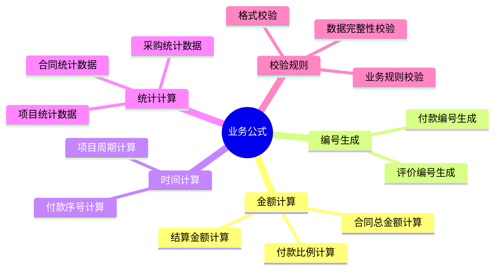

# 项目采购与成本管理系统 - 业务逻辑公式手册

## 文档信息

**文档版本：** v1.0  
**创建日期：** 2025-10-21  
**覆盖范围：** 全系统业务计算公式、校验规则、业务规则映射  
**目标读者：** 开发人员、业务分析师、数据管理员  

---

## 1. 公式概览

### 1.1 核心计算公式分类



### 1.2 公式应用场景

| 业务场景 | 涉及公式 | 计算复杂度 | 使用频率 |
|----------|----------|------------|----------|
| **付款进度跟踪** | 付款比例计算 | 中等 | 高 |
| **合同管理** | 合同总金额计算 | 简单 | 高 |
| **数据导入** | 编号生成 | 简单 | 高 |
| **统计分析** | 各类统计计算 | 中等 | 中 |
| **数据验证** | 校验规则 | 复杂 | 高 |

---

## 2. 金额计算公式

### 2.1 付款比例计算

#### 2.1.1 业务需求

计算合同的付款进度，帮助项目管理人员了解资金使用情况，预警超付款风险。

#### 2.1.2 计算公式

```python
def get_payment_ratio(self):
    """
    付款比例计算公式
    
    基础公式：
    付款比例 = (累计付款金额 ÷ 基准金额) × 100%
    
    基准金额确定规则：
    1. 如果有结算价，使用结算价作为基准
    2. 否则使用（合同价 + 补充协议金额）作为基准
    """
    from django.db.models import Sum
    
    # 步骤1：计算累计付款金额
    total_paid = self.get_total_paid_amount()
    
    # 步骤2：确定基准金额
    base_amount = 0
    
    if self.file_positioning == '主合同':
        # 规则1：优先使用结算价
        try:
            if hasattr(self, 'settlement') and self.settlement and self.settlement.final_amount:
                base_amount = self.settlement.final_amount
            else:
                # 规则2：使用合同价 + 补充协议金额
                base_amount = self.contract_amount or 0
                supplements_total = self.supplements.aggregate(
                    total=Sum('contract_amount')
                )['total'] or 0
                base_amount += supplements_total
        except:
            # 异常处理：使用合同价 + 补充协议金额
            base_amount = self.contract_amount or 0
            supplements_total = self.supplements.aggregate(
                total=Sum('contract_amount')
            )['total'] or 0
            base_amount += supplements_total
    else:
        # 补充协议或解除协议，使用自身合同价
        base_amount = self.contract_amount or 0
    
    # 步骤3：计算比例
    if base_amount > 0:
        return (total_paid / base_amount) * 100
    return 0
```

#### 2.1.3 计算示例

| 场景 | 合同金额 | 补充协议金额 | 结算价 | 累计付款 | 付款比例 | 计算过程 |
|------|----------|--------------|--------|----------|----------|----------|
| **场景1** | 500,000 | 50,000 | - | 300,000 | 54.55% | 300,000 ÷ (500,000 + 50,000) × 100% |
| **场景2** | 500,000 | 50,000 | 580,000 | 580,000 | 100% | 580,000 ÷ 580,000 × 100% |
| **场景3** | - | 50,000 | - | 25,000 | 50% | 25,000 ÷ 50,000 × 100% |

#### 2.1.4 边界条件处理

```python
# 边界条件1：基准金额为0
if base_amount <= 0:
    return 0  # 避免除零错误

# 边界条件2：付款金额超过基准金额
if total_paid > base_amount * 1.2:  # 超过120%预警
    # 可以添加预警逻辑
    logger.warning(f'合同 {self.contract_code} 付款比例异常: {payment_ratio:.2f}%')

# 边界条件3：数据异常处理
try:
    base_amount = self.settlement.final_amount
except AttributeError:
    base_amount = self.contract_amount or 0
```

### 2.2 合同总金额计算

#### 2.2.1 业务需求

计算主合同及其所有补充协议的总金额，用于项目成本统计和付款基准计算。

#### 2.2.2 计算公式

```python
def get_contract_with_supplements_amount(self):
    """
    合同总金额计算公式
    
    公式：
    合同总金额 = 主合同金额 + Σ(所有补充协议金额)
    
    适用范围：
    - 仅对主合同计算总金额
    - 补充协议调用时返回其主合同的总金额
    """
    from django.db.models import Sum
    
    if self.file_positioning == '主合同':
        # 步骤1：获取主合同金额
        total = self.contract_amount or 0
        
        # 步骤2：计算所有补充协议金额总和
        supplements_total = self.supplements.aggregate(
            total=Sum('contract_amount')
        )['total'] or 0
        
        # 步骤3：计算总金额
        return total + supplements_total
    else:
        # 如果是补充协议，返回其主合同的总金额
        if self.parent_contract:
            return self.parent_contract.get_contract_with_supplements_amount()
        return self.contract_amount or 0
```

#### 2.2.3 计算示例

| 合同类型 | 合同金额 | 关联主合同 | 补充协议金额 | 总金额 | 计算过程 |
|----------|----------|------------|--------------|--------|----------|
| 主合同 | 500,000 | - | 50,000 + 30,000 | 580,000 | 500,000 + 50,000 + 30,000 |
| 补充协议1 | 50,000 | 主合同 | - | 580,000 | 返回主合同总金额 |
| 补充协议2 | 30,000 | 主合同 | - | 580,000 | 返回主合同总金额 |

### 2.3 结算金额计算

#### 2.3.1 业务需求

计算主合同及所有补充协议的合同总额，作为结算金额的参考基准。

#### 2.3.2 计算公式

```python
def get_total_contract_amount(self):
    """
    结算金额计算公式
    
    公式：
    结算参考金额 = 主合同金额 + Σ(所有补充协议金额)
    
    用途：
    - 作为最终结算金额的参考
    - 验证结算金额的合理性
    """
    from django.db.models import Sum
    
    # 步骤1：获取主合同金额
    total = self.main_contract.contract_amount or 0
    
    # 步骤2：计算所有补充协议金额总和
    supplements_total = self.main_contract.supplements.aggregate(
        total=Sum('contract_amount')
    )['total'] or 0
    
    # 步骤3：计算总金额
    return total + supplements_total
```

#### 2.3.3 结算合理性校验

```python
def validate_settlement_amount(self):
    """
    结算金额合理性校验
    
    校验规则：
    - 结算金额应在合同总金额的80%-120%范围内
    - 超出范围需要说明原因
    """
    contract_total = self.get_total_contract_amount()
    settlement_amount = self.final_amount
    
    if contract_total > 0:
        ratio = (settlement_amount / contract_total) * 100
        
        if ratio < 80:
            logger.warning(f'结算金额偏低: {ratio:.1f}% (合同总金额: {contract_total})')
        elif ratio > 120:
            logger.warning(f'结算金额偏高: {ratio:.1f}% (合同总金额: {contract_total})')
```

---

## 3. 编号生成公式

### 3.1 付款编号生成

#### 3.1.1 业务需求

自动生成付款编号，确保编号的唯一性和有序性，便于付款记录的管理和查询。

#### 3.1.2 编号规则

**格式：** `合同标识-FK-序号`
- **合同标识：** 优先使用合同序号，如无则使用合同编号
- **FK：** 固定标识，代表付款
- **序号：** 3位数字，从001开始，按付款日期排序

#### 3.1.3 生成算法

```python
def _generate_payment_code(self):
    """
    付款编号生成算法
    
    算法步骤：
    1. 确定合同标识
    2. 查询该合同所有付款记录
    3. 按付款日期排序
    4. 计算当前付款的序号
    5. 生成完整编号
    """
    # 步骤1：确定合同标识
    contract_identifier = self.contract.contract_sequence or self.contract.contract_code
    
    # 步骤2：查询该合同所有付款记录，按付款日期排序
    existing_payments = Payment.objects.filter(
        contract=self.contract
    ).order_by('payment_date', 'created_at')
    
    # 步骤3：计算当前付款的序号
    sequence = 1
    for payment in existing_payments:
        # 排除当前正在更新的记录
        if self.pk and payment.pk == self.pk:
            continue
        
        # 按付款日期排序，早于当前付款的记录序号+1
        if payment.payment_date < self.payment_date:
            sequence += 1
        elif payment.payment_date == self.payment_date and payment.created_at < self.created_at:
            # 同一天付款，按创建时间排序
            sequence += 1
    
    # 步骤4：生成完整编号
    return f"{contract_identifier}-FK-{sequence:03d}"
```

#### 3.1.4 生成示例

| 合同标识 | 付款日期 | 创建时间 | 现有付款数 | 生成编号 | 说明 |
|----------|----------|----------|------------|----------|------|
| HT2025001 | 2025-01-15 | 09:00 | 0 | HT2025001-FK-001 | 第一笔付款 |
| HT2025001 | 2025-02-15 | 10:00 | 1 | HT2025001-FK-002 | 第二笔付款 |
| HT2025001 | 2025-01-20 | 11:00 | 2 | HT2025001-FK-003 | 第三笔付款（日期在第二笔之前） |
| BHHY-NH-014 | 2025-03-01 | 14:00 | 0 | BHHY-NH-014-FK-001 | 使用合同序号 |

#### 3.1.5 并发处理

```python
def _generate_payment_code_with_lock(self):
    """
    并发安全的付款编号生成
    
    使用数据库锁确保编号唯一性
    """
    from django.db import transaction
    
    with transaction.atomic():
        # 锁定合同记录
        locked_contract = Contract.objects.select_for_update().get(
            pk=self.contract.pk
        )
        
        # 重新查询付款记录
        existing_payments = Payment.objects.filter(
            contract=locked_contract
        ).order_by('payment_date', 'created_at')
        
        # 计算序号并生成编号
        sequence = len(existing_payments) + 1
        contract_identifier = locked_contract.contract_sequence or locked_contract.contract_code
        
        return f"{contract_identifier}-FK-{sequence:03d}"
```

### 3.2 评价编号生成

#### 3.2.1 业务需求

为供应商评价生成唯一编号，便于评价记录的管理和追溯。

#### 3.2.2 编号规则

**格式：** `合同编号-PJ-序号`
- **合同编号：** 关联合同的编号
- **PJ：** 固定标识，代表评价（PingJia）
- **序号：** 3位数字，从001开始

#### 3.2.3 生成算法

```python
def _generate_evaluation_code(self, contract, seq):
    """
    评价编号生成算法
    
    参数：
    - contract: 关联合同对象
    - seq: 序号（由导入程序传入）
    
    算法：
    评价编号 = 合同编号-PJ-序号
    """
    return f"{contract.contract_code}-PJ-{seq:03d}"
```

#### 3.2.4 生成示例

| 合同编号 | 序号 | 生成编号 | 说明 |
|----------|------|----------|------|
| HT2025001 | 1 | HT2025001-PJ-001 | 第一个评价 |
| HT2025001 | 2 | HT2025001-PJ-002 | 第二个评价 |
| HT2025002 | 1 | HT2025002-PJ-001 | 另一个合同的第一个评价 |

---

## 4. 时间计算公式

### 4.1 项目周期计算

#### 4.1.1 业务需求

计算项目的执行周期，帮助项目管理人员了解项目进度和时间安排。

#### 4.1.2 计算公式

```python
def calculate_project_duration(self):
    """
    项目周期计算公式
    
    公式：
    项目周期 = 项目结束日期 - 项目开始日期
    
    如果项目未结束，使用当前日期计算
    """
    from datetime import date
    
    # 获取项目开始日期（最早关联的采购开标日期）
    start_date = self.get_project_start_date()
    
    # 获取项目结束日期
    if self.status == '已完成':
        end_date = self.get_project_end_date()
    else:
        end_date = date.today()  # 使用当前日期
    
    # 计算周期
    if start_date and end_date:
        duration = end_date - start_date
        return duration.days
    
    return None

def get_project_start_date(self):
    """获取项目开始日期（最早采购开标日期）"""
    from django.db.models import Min
    
    earliest_date = self.procurements.aggregate(
        earliest=Min('bid_opening_date')
    )['earliest']
    
    return earliest_date

def get_project_end_date(self):
    """获取项目结束日期（最晚结算完成日期）"""
    from django.db.models import Max
    
    latest_date = Settlement.objects.filter(
        main_contract__project=self
    ).aggregate(
        latest=Max('completion_date')
    )['latest']
    
    return latest_date
```

#### 4.1.3 计算示例

| 项目开始日期 | 项目结束日期 | 当前日期 | 项目状态 | 计算周期 | 说明 |
|--------------|--------------|----------|----------|----------|------|
| 2025-01-15 | 2025-12-20 | - | 已完成 | 339天 | 实际项目周期 |
| 2025-01-15 | - | 2025-10-21 | 进行中 | 279天 | 从开始到当前的天数 |
| - | 2025-12-20 | - | 已完成 | None | 无法计算（缺少开始日期） |

### 4.2 采购周期计算

#### 4.2.1 业务需求

计算采购从需求到完成的周期，评估采购效率。

#### 4.2.2 计算公式

```python
def calculate_procurement_cycle(self):
    """
    采购周期计算公式
    
    公式：
    采购周期 = 中标通知书发放日期 - 采购需求书审批完成日期
    
    如果缺少需求审批日期，使用开标日期
    """
    if self.notice_issue_date and self.requirement_approval_date:
        # 完整周期：从需求审批到中标通知
        cycle = self.notice_issue_date - self.requirement_approval_date
        return cycle.days
    elif self.notice_issue_date and self.bid_opening_date:
        # 部分周期：从开标到中标通知
        cycle = self.notice_issue_date - self.bid_opening_date
        return cycle.days
    
    return None
```

#### 4.2.3 计算示例

| 需求审批日期 | 开标日期 | 中标通知日期 | 采购周期 | 说明 |
|--------------|----------|--------------|----------|------|
| 2025-01-10 | 2025-01-15 | 2025-01-25 | 15天 | 完整采购周期 |
| - | 2025-01-15 | 2025-01-25 | 10天 | 部分采购周期 |
| 2025-01-10 | - | - | None | 缺少必要日期 |

---

## 5. 统计计算公式

### 5.1 项目统计数据

#### 5.1.1 业务需求

统计项目的各项关键指标，为管理决策提供数据支持。

#### 5.1.2 统计公式

```python
def get_project_statistics(self):
    """
    项目统计数据计算
    
    统计指标：
    1. 关联采购数量
    2. 关联合同数量
    3. 合同总金额
    4. 累计付款金额
    5. 付款进度
    6. 已结算合同数量
    """
    from django.db.models import Sum, Count, Q
    from payment.models import Payment
    from settlement.models import Settlement
    
    stats = {}
    
    # 1. 关联采购数量
    stats['procurement_count'] = self.procurements.count()
    
    # 2. 关联合同数量
    stats['contract_count'] = self.contracts.count()
    
    # 3. 合同总金额
    stats['total_contract_amount'] = self.contracts.aggregate(
        total=Sum('contract_amount')
    )['total'] or 0
    
    # 4. 累计付款金额
    stats['total_paid_amount'] = Payment.objects.filter(
        contract__project=self
    ).aggregate(
        total=Sum('payment_amount')
    )['total'] or 0
    
    # 5. 付款进度
    if stats['total_contract_amount'] > 0:
        stats['payment_progress'] = (
            stats['total_paid_amount'] / stats['total_contract_amount']
        ) * 100
    else:
        stats['payment_progress'] = 0
    
    # 6. 已结算合同数量
    stats['settled_contract_count'] = Contract.objects.filter(
        Q(project=self) & (
            Q(settlement__isnull=False) |
            Q(payments__is_settled=True)
        )
    ).distinct().count()
    
    return stats
```

#### 5.1.3 统计示例

| 统计指标 | 计算结果 | 说明 |
|----------|----------|------|
| 关联采购数量 | 5 | 项目包含5个采购 |
| 关联合同数量 | 8 | 项目包含8个合同 |
| 合同总金额 | 2,500,000 | 所有合同金额总和 |
| 累计付款金额 | 1,200,000 | 所有付款金额总和 |
| 付款进度 | 48% | 付款占合同金额比例 |
| 已结算合同数量 | 3 | 已完成结算的合同数 |

### 5.2 采购统计数据

#### 5.2.1 业务需求

统计采购的各项指标，评估采购效率和成本控制情况。

#### 5.2.2 统计公式

```python
def get_procurement_statistics(self):
    """
    采购统计数据计算
    
    统计指标：
    1. 预算执行率
    2. 中标率（中标价/预算价）
    3. 控制价执行率（中标价/控制价）
    4. 采购周期统计
    """
    stats = {}
    
    # 1. 预算执行率
    if self.budget_amount and self.budget_amount > 0:
        stats['budget_execution_rate'] = (
            (self.winning_amount or 0) / self.budget_amount
        ) * 100
    else:
        stats['budget_execution_rate'] = None
    
    # 2. 控制价执行率
    if self.control_price and self.control_price > 0:
        stats['control_price_rate'] = (
            (self.winning_amount or 0) / self.control_price
        ) * 100
    else:
        stats['control_price_rate'] = None
    
    # 3. 采购周期
    stats['procurement_cycle'] = self.calculate_procurement_cycle()
    
    # 4. 节约金额
    if self.control_price and self.winning_amount:
        stats['savings_amount'] = self.control_price - self.winning_amount
        if self.control_price > 0:
            stats['savings_rate'] = (stats['savings_amount'] / self.control_price) * 100
    else:
        stats['savings_amount'] = None
        stats['savings_rate'] = None
    
    return stats
```

#### 5.2.3 统计示例

| 统计指标 | 计算结果 | 说明 |
|----------|----------|------|
| 预算金额 | 1,000,000 | 采购预算 |
| 中标金额 | 950,000 | 实际中标价 |
| 控制价 | 980,000 | 采购控制价 |
| 预算执行率 | 95% | 中标价占预算比例 |
| 控制价执行率 | 96.94% | 中标价占控制价比例 |
| 节约金额 | 30,000 | 相比控制价节约 |
| 节约率 | 3.06% | 节约金额占控制价比例 |

### 5.3 合同统计数据

#### 5.3.1 业务需求

统计合同的执行情况，包括付款进度、结算状态等。

#### 5.3.2 统计公式

```python
def get_contract_statistics(self):
    """
    合同统计数据计算
    
    统计指标：
    1. 付款笔数
    2. 累计付款金额
    3. 付款比例
    4. 平均付款间隔
    5. 是否已结算
    """
    from django.db.models import Avg, Count, Sum
    from datetime import timedelta
    
    stats = {}
    
    # 1. 付款笔数
    stats['payment_count'] = self.payments.count()
    
    # 2. 累计付款金额
    stats['total_paid_amount'] = self.payments.aggregate(
        total=Sum('payment_amount')
    )['total'] or 0
    
    # 3. 付款比例
    stats['payment_ratio'] = self.get_payment_ratio()
    
    # 4. 平均付款间隔
    if stats['payment_count'] > 1:
        payments = self.payments.order_by('payment_date')
        intervals = []
        for i in range(1, len(payments)):
            interval = (payments[i].payment_date - payments[i-1].payment_date).days
            intervals.append(interval)
        
        if intervals:
            stats['avg_payment_interval'] = sum(intervals) / len(intervals)
        else:
            stats['avg_payment_interval'] = None
    else:
        stats['avg_payment_interval'] = None
    
    # 5. 结算状态
    stats['is_settled'] = hasattr(self, 'settlement') and self.settlement is not None
    
    return stats
```

#### 5.3.3 统计示例

| 统计指标 | 计算结果 | 说明 |
|----------|----------|------|
| 付款笔数 | 4 | 共4笔付款 |
| 累计付款金额 | 480,000 | 已付款总额 |
| 付款比例 | 96% | 付款进度 |
| 平均付款间隔 | 30天 | 付款平均间隔 |
| 是否已结算 | True | 已完成结算 |

---

## 6. 校验规则公式

### 6.1 业务规则校验

#### 6.1.1 合同业务规则校验

```python
def validate_contract_business_rules(self):
    """
    合同业务规则校验
    
    校验规则：
    1. 补充协议必须关联主合同
    2. 主合同不能关联其他合同
    3. 解除协议必须关联主合同
    4. 采购合同必须关联采购项目
    5. 直接签订合同不能关联采购项目
    """
    errors = {}
    
    # 规则1：补充协议必须关联主合同
    if self.file_positioning == '补充协议' and not self.parent_contract:
        errors['parent_contract'] = '补充协议必须关联主合同'
    
    # 规则2：主合同不能关联其他合同
    if self.file_positioning == '主合同' and self.parent_contract:
        errors['parent_contract'] = '主合同不能关联其他合同'
    
    # 规则3：解除协议必须关联主合同
    if self.file_positioning == '解除协议' and not self.parent_contract:
        errors['parent_contract'] = '解除协议必须关联主合同'
    
    # 规则4：采购合同必须关联采购项目
    if self.contract_source == '采购合同' and not self.procurement:
        errors['procurement'] = '采购合同必须关联采购项目'
    
    # 规则5：直接签订合同不能关联采购项目
    if self.contract_source == '直接签订' and self.procurement:
        errors['procurement'] = '直接签订合同不应关联采购项目'
    
    return errors
```

#### 6.1.2 付款业务规则校验

```python
def validate_payment_business_rules(self):
    """
    付款业务规则校验
    
    校验规则：
    1. 付款金额不能为负数
    2. 付款日期不能早于合同签订日期
    3. 累计付款不超过合理范围
    """
    errors = {}
    
    # 规则1：付款金额不能为负数
    if self.payment_amount and self.payment_amount <= 0:
        errors['payment_amount'] = '付款金额必须大于0'
    
    # 规则2：付款日期不能早于合同签订日期
    if (self.payment_date and self.contract.signing_date and 
        self.payment_date < self.contract.signing_date):
        errors['payment_date'] = '付款日期不能早于合同签订日期'
    
    # 规则3：累计付款不超过合理范围（可选）
    total_paid = self.contract.get_total_paid_amount()
    if self.pk:  # 更新时排除当前记录
        old_payment = Payment.objects.get(pk=self.pk)
        total_paid -= old_payment.payment_amount
    
    total_paid += self.payment_amount
    
    # 基准金额
    base_amount = self.contract.get_contract_with_supplements_amount()
    if base_amount > 0 and total_paid > base_amount * 1.5:
        errors['payment_amount'] = f'累计付款 {total_paid} 超过合理范围'
    
    return errors
```

### 6.2 数据完整性校验

#### 6.2.1 关联数据完整性校验

```python
def validate_data_integrity(self):
    """
    数据完整性校验
    
    校验项目：
    1. 关联记录是否存在
    2. 循环引用检查
    3. 必要字段完整性
    """
    errors = {}
    
    # 1. 关联记录存在性检查
    if self.project_id and not Project.objects.filter(pk=self.project_id).exists():
        errors['project'] = '关联的项目不存在'
    
    if self.procurement_id and not Procurement.objects.filter(pk=self.procurement_id).exists():
        errors['procurement'] = '关联的采购不存在'
    
    if self.parent_contract_id and not Contract.objects.filter(pk=self.parent_contract_id).exists():
        errors['parent_contract'] = '关联的主合同不存在'
    
    # 2. 循环引用检查
    if self.parent_contract_id:
        if self.has_circular_reference():
            errors['parent_contract'] = '存在循环引用'
    
    # 3. 必要字段完整性检查
    if self.file_positioning in ['补充协议', '解除协议'] and not self.parent_contract_id:
        errors['parent_contract'] = f'{self.file_positioning}必须关联主合同'
    
    return errors

def has_circular_reference(self, visited=None):
    """
    循环引用检查算法
    
    算法：深度优先搜索
    """
    if visited is None:
        visited = set()
    
    if self.pk in visited:
        return True  # 发现循环引用
    
    visited.add(self.pk)
    
    if self.parent_contract:
        return self.parent_contract.has_circular_reference(visited.copy())
    
    return False
```

#### 6.2.2 数据一致性校验

```python
def validate_data_consistency(self):
    """
    数据一致性校验
    
    校验项目：
    1. 补充协议与主合同的一致性
    2. 付款与合同的一致性
    3. 结算与合同的一致性
    """
    errors = {}
    
    # 1. 补充协议与主合同一致性
    if self.file_positioning in ['补充协议', '解除协议'] and self.parent_contract:
        # 检查项目一致性
        if (self.project_id and self.parent_contract.project_id and 
            self.project_id != self.parent_contract.project_id):
            errors['project'] = '补充协议必须与主合同属于同一项目'
        
        # 检查采购一致性
        if (self.procurement_id and self.parent_contract.procurement_id and 
            self.procurement_id != self.parent_contract.procurement_id):
            errors['procurement'] = '补充协议必须与主合同关联同一采购'
        
        # 检查合同来源一致性
        if self.contract_source != self.parent_contract.contract_source:
            errors['contract_source'] = '补充协议必须与主合同来源一致'
    
    # 2. 付款与合同一致性
    if hasattr(self, 'payments'):
        for payment in self.payments.all():
            if payment.payment_date and self.signing_date:
                if payment.payment_date < self.signing_date:
                    errors[f'payment_{payment.pk}'] = '付款日期早于合同签订日期'
    
    return errors
```

### 6.3 格式校验

#### 6.3.1 编号格式校验

```python
def validate_code_format(self, code, code_type):
    """
    编号格式校验
    
    参数：
    - code: 待校验的编号
    - code_type: 编号类型（project/procurement/contract/payment/settlement）
    
    返回：校验结果和错误信息
    """
    import re
    
    patterns = {
        'project': r'^PRJ\d{7}$',  # PRJ2025001
        'procurement': r'^GC\d{7}$',  # GC2025001
        'contract': r'^HT\d{7}$',  # HT2025001
        'payment': r'^[A-Z0-9-]+-FK-\d{3}$',  # HT2025001-FK-001
        'settlement': r'^JS\d{7}$',  # JS2025001
        'evaluation': r'^[A-Z0-9-]+-PJ-\d{3}$',  # HT2025001-PJ-001
    }
    
    pattern = patterns.get(code_type)
    if not pattern:
        return False, f'不支持的编号类型: {code_type}'
    
    if re.match(pattern, code):
        return True, '格式正确'
    else:
        return False, f'编号格式不正确，应符合格式: {pattern}'
```

#### 6.3.2 金额格式校验

```python
def validate_amount_format(self, amount, field_name):
    """
    金额格式校验
    
    校验规则：
    1. 必须是数字
    2. 不能为负数（特定字段除外）
    3. 小数位数不超过2位
    4. 在合理范围内
    """
    errors = []
    
    # 1. 数字格式检查
    if not isinstance(amount, (int, float, Decimal)):
        errors.append(f'{field_name}必须是数字')
        return errors
    
    # 2. 负数检查
    if amount < 0:
        errors.append(f'{field_name}不能为负数')
    
    # 3. 小数位数检查
    if isinstance(amount, Decimal):
        if amount.as_tuple().exponent < -2:
            errors.append(f'{field_name}小数位数不能超过2位')
    
    # 4. 合理范围检查
    max_amount = Decimal('999999999999.99')  # 9999亿
    if amount > max_amount:
        errors.append(f'{field_name}超出合理范围')
    
    return errors
```

#### 6.3.3 日期格式校验

```python
def validate_date_format(self, date_value, field_name):
    """
    日期格式校验
    
    校验规则：
    1. 日期格式正确
    2. 日期在合理范围内
    3. 日期逻辑关系正确
    """
    errors = []
    
    # 1. 日期格式检查
    if not isinstance(date_value, date):
        errors.append(f'{field_name}格式不正确')
        return errors
    
    # 2. 合理范围检查
    min_date = date(2000, 1, 1)
    max_date = date(2050, 12, 31)
    
    if date_value < min_date or date_value > max_date:
        errors.append(f'{field_name}超出合理范围')
    
    # 3. 逻辑关系检查（针对特定字段）
    if field_name == 'bid_opening_date' and hasattr(self, 'notice_issue_date'):
        if self.notice_issue_date and date_value > self.notice_issue_date:
            errors.append('开标日期不能晚于中标通知书发放日期')
    
    return errors
```

---

## 7. 业务规则映射

### 7.1 合同分类规则映射

#### 7.1.1 合同来源自动判定

```python
def determine_contract_source(self):
    """
    合同来源自动判定规则
    
    判定逻辑：
    1. 如果关联了采购项目 → 采购合同
    2. 如果未关联采购项目 → 直接签订
    3. 补充协议继承主合同的来源类型
    """
    if self.file_positioning in ['补充协议', '解除协议'] and self.parent_contract:
        # 继承主合同的来源类型
        return self.parent_contract.contract_source
    else:
        # 根据是否关联采购判定
        if self.procurement:
            return '采购合同'
        else:
            return '直接签订'
```

#### 7.1.2 合同类型权限映射

```python
def get_contract_type_permissions(self):
    """
    合同类型权限映射
    
    权限规则：
    1. 主合同：可以独立创建
    2. 补充协议：必须基于主合同创建
    3. 解除协议：必须基于主合同创建
    """
    permissions = {
        '主合同': {
            'can_create_independent': True,
            'requires_parent': False,
            'allowed_sources': ['采购合同', '直接签订']
        },
        '补充协议': {
            'can_create_independent': False,
            'requires_parent': True,
            'allowed_sources': None,  # 继承主合同
        },
        '解除协议': {
            'can_create_independent': False,
            'requires_parent': True,
            'allowed_sources': None,  # 继承主合同
        }
    }
    
    return permissions.get(self.file_positioning, {})
```

### 7.2 付款状态规则映射

#### 7.2.1 付款状态自动判定

```python
def determine_payment_status(self):
    """
    付款状态自动判定
    
    判定规则：
    1. 有结算价且标记为已结算 → 已结算
    2. 付款比例达到100% → 已付清
    3. 付款比例大于0 → 部分付款
    4. 无付款记录 → 未付款
    """
    payment_ratio = self.get_payment_ratio()
    
    # 检查是否有结算标记
    has_settlement_flag = self.payments.filter(is_settled=True).exists()
    if has_settlement_flag:
        return '已结算'
    
    # 根据付款比例判断
    if payment_ratio >= 100:
        return '已付清'
    elif payment_ratio > 0:
        return '部分付款'
    else:
        return '未付款'
```

#### 7.2.2 付款预警规则

```python
def get_payment_warnings(self):
    """
    付款预警规则
    
    预警规则：
    1. 付款比例超过100% → 超付款预警
    2. 付款比例超过90% → 接近付清预警
    3. 长期未付款 → 逾期预警
    """
    warnings = []
    payment_ratio = self.get_payment_ratio()
    
    # 超付款预警
    if payment_ratio > 100:
        warnings.append({
            'level': 'error',
            'message': f'付款比例异常 ({payment_ratio:.1f}%)，超过100%'
        })
    
    # 接近付清预警
    elif payment_ratio > 90:
        warnings.append({
            'level': 'warning',
            'message': f'付款比例接近100% ({payment_ratio:.1f}%)'
        })
    
    # 长期未付款预警
    if self.signing_date:
        days_since_signing = (date.today() - self.signing_date).days
        if days_since_signing > 365 and payment_ratio == 0:
            warnings.append({
                'level': 'warning',
                'message': f'合同签订超过{days_since_signing}天仍未付款'
            })
    
    return warnings
```

### 7.3 项目状态规则映射

#### 7.3.1 项目状态自动判定

```python
def determine_project_status(self):
    """
    项目状态自动判定
    
    判定规则：
    1. 所有合同都已结算 → 已完成
    2. 有合同正在进行 → 进行中
    3. 长期无活动 → 已暂停
    """
    from datetime import timedelta
    
    contracts = self.contracts.all()
    
    if not contracts.exists():
        return '未开始'
    
    # 检查是否所有合同都已结算
    settled_count = contracts.filter(
        settlement__isnull=False
    ).count()
    
    if settled_count == contracts.count():
        return '已完成'
    
    # 检查最近的活动时间
    latest_payment = Payment.objects.filter(
        contract__project=self
    ).order_by('-payment_date').first()
    
    if latest_payment:
        days_since_last_activity = (date.today() - latest_payment.payment_date).days
        if days_since_last_activity > 365:
            return '已暂停'
    
    return '进行中'
```

---

## 8. 公式性能优化

### 8.1 计算缓存策略

#### 8.1.1 付款比例缓存

```python
from django.core.cache import cache

def get_payment_ratio_cached(self):
    """
    付款比例计算（带缓存）
    
    缓存策略：
    - 缓存键：payment_ratio_{contract_id}
    - 缓存时间：1小时
    - 失效条件：付款记录变更时清除
    """
    cache_key = f'payment_ratio_{self.contract_code}'
    cached_ratio = cache.get(cache_key)
    
    if cached_ratio is not None:
        return cached_ratio
    
    # 计算付款比例
    ratio = self.get_payment_ratio()
    
    # 缓存结果
    cache.set(cache_key, ratio, 3600)  # 1小时
    
    return ratio

def clear_payment_ratio_cache(self):
    """清除付款比例缓存"""
    cache_key = f'payment_ratio_{self.contract_code}'
    cache.delete(cache_key)
    
    # 同时清除相关统计缓存
    cache.delete(f'project_stats_{self.project.project_code}')
```

#### 8.1.2 统计数据缓存

```python
def get_project_statistics_cached(self):
    """
    项目统计数据（带缓存）
    
    缓存策略：
    - 缓存键：project_stats_{project_id}
    - 缓存时间：30分钟
    - 失效条件：相关数据变更时清除
    """
    cache_key = f'project_stats_{self.project_code}'
    cached_stats = cache.get(cache_key)
    
    if cached_stats is not None:
        return cached_stats
    
    # 计算统计数据
    stats = self.get_project_statistics()
    
    # 缓存结果
    cache.set(cache_key, stats, 1800)  # 30分钟
    
    return stats
```

### 8.2 批量计算优化

#### 8.2.1 批量付款比例计算

```python
def batch_calculate_payment_ratios(contract_ids):
    """
    批量计算付款比例
    
    优化策略：
    1. 一次性查询所有相关数据
    2. 在内存中进行计算
    3. 减少数据库查询次数
    """
    from django.db.models import Sum
    from decimal import Decimal
    
    # 批量查询合同及其付款数据
    contracts = Contract.objects.filter(
        contract_code__in=contract_ids
    ).prefetch_related('payments', 'supplements', 'settlement')
    
    results = {}
    
    for contract in contracts:
        # 计算累计付款
        total_paid = sum(payment.payment_amount for payment in contract.payments.all())
        
        # 确定基准金额
        if contract.contract_type == '主合同':
            if hasattr(contract, 'settlement') and contract.settlement:
                base_amount = contract.settlement.final_amount
            else:
                base_amount = contract.contract_amount or Decimal('0')
                supplements_total = sum(
                    supplement.contract_amount for supplement in contract.supplements.all()
                )
                base_amount += supplements_total
        else:
            base_amount = contract.contract_amount or Decimal('0')
        
        # 计算比例
        ratio = (total_paid / base_amount * 100) if base_amount > 0 else 0
        
        results[contract.contract_code] = {
            'total_paid': total_paid,
            'base_amount': base_amount,
            'payment_ratio': ratio
        }
    
    return results
```

#### 8.2.2 批量统计数据计算

```python
def batch_calculate_project_statistics(project_ids):
    """
    批量计算项目统计数据
    
    优化策略：
    1. 使用聚合查询减少数据传输
    2. 批量处理多个项目
    3. 避免重复查询
    """
    from django.db.models import Sum, Count, Q
    
    # 批量查询项目数据
    projects = Project.objects.filter(project_code__in=project_ids)
    
    # 预先计算聚合数据
    procurement_stats = Procurement.objects.filter(
        project__in=projects
    ).values('project__project_code').annotate(
        procurement_count=Count('procurement_code'),
        total_budget=Sum('budget_amount'),
        total_winning=Sum('winning_amount')
    )
    
    contract_stats = Contract.objects.filter(
        project__in=projects
    ).values('project__project_code').annotate(
        contract_count=Count('contract_code'),
        total_amount=Sum('contract_amount')
    )
    
    payment_stats = Payment.objects.filter(
        contract__project__in=projects
    ).values('contract__project__project_code').annotate(
        total_paid=Sum('payment_amount'),
        payment_count=Count('payment_code')
    )
    
    # 组装结果
    results = {}
    
    for project in projects:
        project_code = project.project_code
        result = {
            'project_name': project.project_name,
            'project_manager': project.project_manager,
            'status': project.status,
        }
        
        # 添加采购统计
        proc_stat = next((s for s in procurement_stats if s['project__project_code'] == project_code), {})
        result.update({
            'procurement_count': proc_stat.get('procurement_count', 0),
            'total_budget': proc_stat.get('total_budget') or Decimal('0'),
            'total_winning': proc_stat.get('total_winning') or Decimal('0'),
        })
        
        # 添加合同统计
        cont_stat = next((s for s in contract_stats if s['project__project_code'] == project_code), {})
        result.update({
            'contract_count': cont_stat.get('contract_count', 0),
            'total_contract_amount': cont_stat.get('total_amount') or Decimal('0'),
        })
        
        # 添加付款统计
        pay_stat = next((s for s in payment_stats if s['contract__project__project_code'] == project_code), {})
        result.update({
            'payment_count': pay_stat.get('payment_count', 0),
            'total_paid_amount': pay_stat.get('total_paid') or Decimal('0'),
        })
        
        # 计算付款进度
        total_amount = result['total_contract_amount']
        total_paid = result['total_paid_amount']
        result['payment_progress'] = (total_paid / total_amount * 100) if total_amount > 0 else 0
        
        results[project_code] = result
    
    return results
```

---

## 9. 公式测试用例

### 9.1 付款比例计算测试

```python
class TestPaymentRatioCalculation(TestCase):
    """付款比例计算测试用例"""
    
    def setUp(self):
        """测试数据准备"""
        self.project = Project.objects.create(
            project_code='PRJ2025001',
            project_name='测试项目'
        )
        
        self.main_contract = Contract.objects.create(
            contract_code='HT2025001',
            project=self.project,
            contract_name='主合同',
            contract_type='主合同',
            contract_amount=Decimal('500000.00')
        )
        
        self.supplement = Contract.objects.create(
            contract_code='HT2025001-01',
            project=self.project,
            parent_contract=self.main_contract,
            contract_name='补充协议',
            contract_type='补充协议',
            contract_amount=Decimal('50000.00')
        )
    
    def test_payment_ratio_without_settlement(self):
        """测试无结算价时的付款比例计算"""
        # 创建付款记录
        Payment.objects.create(
            contract=self.main_contract,
            payment_amount=Decimal('300000.00'),
            payment_date=date(2025, 1, 15)
        )
        
        ratio = self.main_contract.get_payment_ratio()
        
        # 预期：300000 ÷ (500000 + 50000) × 100% = 54.55%
        self.assertAlmostEqual(ratio, 54.55, places=2)
    
    def test_payment_ratio_with_settlement(self):
        """测试有结算价时的付款比例计算"""
        # 创建结算记录
        Settlement.objects.create(
            settlement_code='JS2025001',
            main_contract=self.main_contract,
            final_amount=Decimal('580000.00')
        )
        
        # 创建付款记录
        Payment.objects.create(
            contract=self.main_contract,
            payment_amount=Decimal('580000.00'),
            payment_date=date(2025, 1, 15)
        )
        
        ratio = self.main_contract.get_payment_ratio()
        
        # 预期：580000 ÷ 580000 × 100% = 100%
        self.assertEqual(ratio, 100)
    
    def test_payment_ratio_zero_base_amount(self):
        """测试基准金额为0时的处理"""
        contract = Contract.objects.create(
            contract_code='HT2025002',
            project=self.project,
            contract_name='零金额合同',
            contract_type='主合同',
            contract_amount=Decimal('0')
        )
        
        ratio = contract.get_payment_ratio()
        
        # 预期：返回0，避免除零错误
        self.assertEqual(ratio, 0)
```

### 9.2 编号生成测试

```python
class TestCodeGeneration(TestCase):
    """编号生成测试用例"""
    
    def setUp(self):
        """测试数据准备"""
        self.contract = Contract.objects.create(
            contract_code='HT2025001',
            contract_sequence='HT2025001',
            contract_name='测试合同',
            contract_type='主合同'
        )
    
    def test_payment_code_generation_first(self):
        """测试第一笔付款编号生成"""
        payment = Payment.objects.create(
            contract=self.contract,
            payment_amount=Decimal('100000.00'),
            payment_date=date(2025, 1, 15)
        )
        
        # 预期：HT2025001-FK-001
        self.assertEqual(payment.payment_code, 'HT2025001-FK-001')
    
    def test_payment_code_generation_multiple(self):
        """测试多笔付款编号生成"""
        # 创建多笔付款
        payment1 = Payment.objects.create(
            contract=self.contract,
            payment_amount=Decimal('100000.00'),
            payment_date=date(2025, 1, 15)
        )
        
        payment2 = Payment.objects.create(
            contract=self.contract,
            payment_amount=Decimal('100000.00'),
            payment_date=date(2025, 2, 15)
        )
        
        payment3 = Payment.objects.create(
            contract=self.contract,
            payment_amount=Decimal('100000.00'),
            payment_date=date(2025, 1, 20)  # 日期在第二笔之前
        )
        
        self.assertEqual(payment1.payment_code, 'HT2025001-FK-001')
        self.assertEqual(payment3.payment_code, 'HT2025001-FK-002')  # 按日期排序
        self.assertEqual(payment2.payment_code, 'HT2025001-FK-003')
    
    def test_payment_code_generation_with_sequence(self):
        """测试使用合同序号生成付款编号"""
        contract_with_sequence = Contract.objects.create(
            contract_code='HT2025002',
            contract_sequence='BHHY-NH-014',
            contract_name='测试合同2',
            contract_type='主合同'
        )
        
        payment = Payment.objects.create(
            contract=contract_with_sequence,
            payment_amount=Decimal('100000.00'),
            payment_date=date(2025, 1, 15)
        )
        
        # 预期：使用合同序号 BHHY-NH-014-FK-001
        self.assertEqual(payment.payment_code, 'BHHY-NH-014-FK-001')
```

### 9.3 业务规则校验测试

```python
class TestBusinessRuleValidation(TestCase):
    """业务规则校验测试用例"""
    
    def test_supplement_contract_must_have_parent(self):
        """测试补充协议必须关联主合同"""
        supplement = Contract(
            contract_code='HT2025001-01',
            contract_name='补充协议',
            contract_type='补充协议',
            parent_contract=None  # 未关联主合同
        )
        
        with self.assertRaises(ValidationError) as context:
            supplement.full_clean()
        
        self.assertIn('补充协议必须关联主合同', str(context.exception))
    
    def test_procurement_contract_must_have_procurement(self):
        """测试采购合同必须关联采购项目"""
        procurement = Procurement.objects.create(
            procurement_code='GC2025001',
            project_name='测试采购'
        )
        
        contract = Contract(
            contract_code='HT2025001',
            contract_name='采购合同',
            contract_type='主合同',
            contract_source='采购合同',
            procurement=None  # 未关联采购
        )
        
        with self.assertRaises(ValidationError) as context:
            contract.full_clean()
        
        self.assertIn('采购合同必须关联采购项目', str(context.exception))
    
    def test_direct_contract_cannot_have_procurement(self):
        """测试直接签订合同不能关联采购项目"""
        procurement = Procurement.objects.create(
            procurement_code='GC2025001',
            project_name='测试采购'
        )
        
        contract = Contract(
            contract_code='HT2025001',
            contract_name='直接签订合同',
            contract_type='主合同',
            contract_source='直接签订',
            procurement=procurement  # 错误地关联了采购
        )
        
        with self.assertRaises(ValidationError) as context:
            contract.full_clean()
        
        self.assertIn('直接签订合同不应关联采购项目', str(context.exception))
```

---

## 10. 总结

### 10.1 公式体系特点

1. **业务驱动**：所有公式都基于实际业务需求设计
2. **逻辑严谨**：考虑了各种边界条件和异常情况
3. **性能优化**：提供了缓存和批量计算优化方案
4. **可测试性**：每个公式都有对应的测试用例
5. **可维护性**：公式逻辑清晰，易于理解和修改

### 10.2 关键公式总结

| 公式类别 | 核心公式 | 业务价值 | 复杂度 |
|----------|----------|----------|--------|
| **金额计算** | 付款比例 = (累计付款 ÷ 基准金额) × 100% | 付款进度跟踪 | 中等 |
| **编号生成** | 付款编号 = 合同标识-FK-序号 | 唯一标识管理 | 简单 |
| **时间计算** | 项目周期 = 结束日期 - 开始日期 | 项目进度管理 | 简单 |
| **统计计算** | 各类聚合统计函数 | 决策支持 | 中等 |
| **校验规则** | 业务规则验证函数 | 数据质量保证 | 复杂 |

### 10.3 使用建议

1. **严格遵循公式逻辑**：特别是业务规则校验，确保数据质量
2. **合理使用缓存**：对于频繁计算的公式，使用缓存提高性能
3. **定期测试验证**：确保公式计算结果的准确性
4. **监控性能指标**：关注复杂公式的执行时间
5. **文档同步更新**：公式变更时及时更新文档

### 10.4 扩展方向

1. **增加更多统计维度**：如供应商绩效统计、项目成本分析
2. **优化计算性能**：引入更高效的算法和数据结构
3. **增强校验规则**：根据业务发展增加新的校验逻辑
4. **可视化展示**：将计算结果通过图表形式展示
5. **预警机制**：基于计算结果建立自动预警系统

---

**文档状态：** ✅ 完成  
**维护责任人：** 业务分析师  
**更新频率：** 根据业务规则变化及时更新  
**相关文档：** [数据模型使用手册](数据模型使用手册.md)、[系统架构分析文档](系统架构分析文档.md)