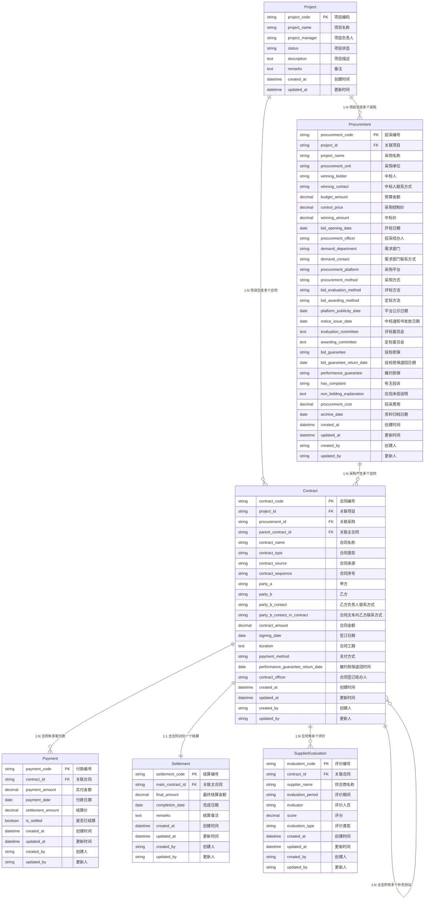
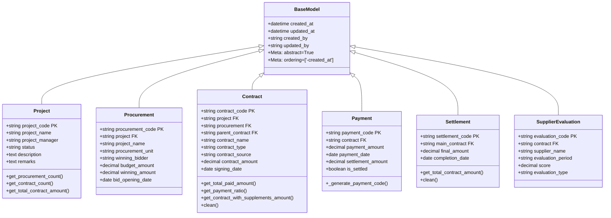
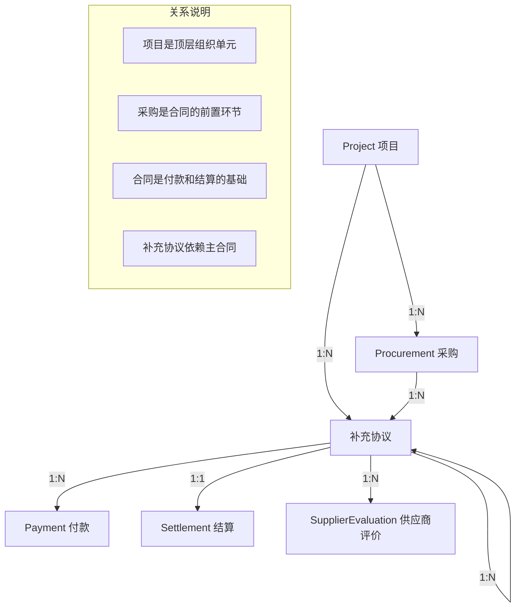

# 项目采购与成本管理系统 - 数据模型使用手册

## 文档信息

**文档版本：** v1.0  
**创建日期：** 2025-10-21  
**覆盖范围：** 全系统数据模型、字段说明、关系映射  
**目标读者：** 开发人员、数据管理员、业务分析师  

---

## 1. 模型概览

### 1.1 模型架构图



### 1.2 模型继承关系



---

## 2. 核心模型详解

### 2.1 Project（项目模型）

#### 2.1.1 模型定位

Project模型是整个系统的顶层组织单元，用于归类和管理多个采购、合同等业务数据。一个项目可以包含多个采购和合同，是业务数据的组织容器。

#### 2.1.2 字段详解

| 字段名 | 类型 | 约束 | 默认值 | 说明 |
|--------|------|------|--------|------|
| `project_code` | CharField(50) | Primary Key | - | 项目唯一编码，格式：PRJ2025001 |
| `project_name` | CharField(200) | Required | - | 项目正式名称，必填 |
| `project_manager` | CharField(50) | Optional | '' | 项目负责人姓名 |
| `status` | CharField(20) | Choices | '进行中' | 项目状态：进行中/已完成/已暂停/已取消 |
| `description` | TextField | Optional | '' | 项目详细描述 |
| `remarks` | TextField | Optional | '' | 项目相关备注 |
| `created_at` | DateTimeField | Auto | now() | 记录创建时间 |
| `updated_at` | DateTimeField | Auto | now() | 记录更新时间 |

#### 2.1.3 关键方法

```python
def get_procurement_count(self):
    """获取关联的采购数量"""
    return self.procurements.count()

def get_contract_count(self):
    """获取关联的合同数量"""
    return self.contracts.count()

def get_total_contract_amount(self):
    """获取关联合同的总金额"""
    from django.db.models import Sum
    total = self.contracts.aggregate(
        total=Sum('contract_amount')
    )['total'] or 0
    return total
```

#### 2.1.4 使用示例

```python
# 创建项目
project = Project.objects.create(
    project_code='PRJ2025001',
    project_name='深圳市天健棚改投资发展有限公司棚改项目',
    project_manager='张三',
    status='进行中'
)

# 查询项目的采购数量
procurement_count = project.get_procurement_count()

# 获取项目合同总金额
total_amount = project.get_total_contract_amount()

# 查询进行中的项目
active_projects = Project.objects.filter(status='进行中')
```

---

### 2.2 Procurement（采购模型）

#### 2.2.1 模型定位

Procurement模型记录采购项目的全生命周期，从采购需求到最终中标的完整过程。一个采购可以产生多个合同，是合同的前置业务环节。

#### 2.2.2 字段详解

| 字段名 | 类型 | 约束 | 默认值 | 说明 |
|--------|------|------|--------|------|
| `procurement_code` | CharField(50) | Primary Key | - | 采购唯一编码，格式：GC2025001 |
| `project` | ForeignKey(Project) | Optional | NULL | 关联的项目，可选 |
| `project_name` | CharField(200) | Required | - | 采购项目名称，必填 |
| `procurement_unit` | CharField(200) | Optional | '' | 发起采购的部门或单位 |
| `planned_completion_date` | DateField | Optional | NULL | 采购计划完成日期 |
| `requirement_approval_date` | DateField | Optional | NULL | 采购需求书审批完成日期 |
| `procurement_officer` | CharField(50) | Optional | '' | 招采经办人 |
| `demand_department` | CharField(100) | Optional | '' | 需求部门 |
| `demand_contact` | CharField(200) | Optional | '' | 需求部门经办人及联系方式 |
| `budget_amount` | DecimalField(15,2) | Optional | NULL | 预算金额 |
| `control_price` | DecimalField(15,2) | Optional | NULL | 采购控制价 |
| `winning_amount` | DecimalField(15,2) | Optional | NULL | 中标价 |
| `procurement_platform` | CharField(100) | Optional | '' | 采购平台 |
| `procurement_method` | CharField(50) | Optional | '' | 采购方式（支持9种标准方式，详见下文说明） |
| `bid_evaluation_method` | CharField(50) | Optional | '' | 评标方法 |
| `bid_awarding_method` | CharField(50) | Optional | '' | 定标方法 |
| `bid_opening_date` | DateField | Optional | NULL | 开标日期 |
| `platform_publicity_date` | DateField | Optional | NULL | 平台中标结果公示完成日期 |
| `notice_issue_date` | DateField | Optional | NULL | 中标通知书发放日期 |
| `evaluation_committee` | TextField | Optional | '' | 评标委员会成员 |
| `awarding_committee` | TextField | Optional | '' | 定标委员会成员 |
| `winning_bidder` | CharField(200) | Optional | '' | 中标人 |
| `winning_contact` | CharField(200) | Optional | '' | 中标人联系人及方式 |
| `bid_guarantee` | CharField(200) | Optional | '' | 投标担保形式及金额 |
| `bid_guarantee_return_date` | DateField | Optional | NULL | 中标单位投标担保退回日期 |
| `performance_guarantee` | CharField(200) | Optional | '' | 履约担保形式及金额 |
| `has_complaint` | CharField(50) | Optional | '' | 全程有无投诉 |
| `non_bidding_explanation` | TextField | Optional | '' | 应招未招说明 |
| `procurement_cost` | DecimalField(15,2) | Optional | NULL | 招采费用 |
| `archive_date` | DateField | Optional | NULL | 资料归档日期 |

#### 2.2.3 索引设计

```python
class Meta:
    indexes = [
        models.Index(fields=['procurement_code']),
        models.Index(fields=['winning_bidder']),
        models.Index(fields=['bid_opening_date']),
        models.Index(fields=['created_at']),
    ]
```

#### 2.2.4 使用示例

```python
# 创建采购记录
procurement = Procurement.objects.create(
    procurement_code='GC2025001',
    project=project,
    project_name='棚改项目咨询服务采购',
    procurement_unit='合约管理部',
    winning_bidder='某某咨询公司',
    winning_amount=Decimal('500000.00'),
    bid_opening_date=date(2025, 1, 15),
    procurement_officer='李四'
)

# 查询某供应商的所有中标记录
supplier_procurements = Procurement.objects.filter(
    winning_bidder='某某咨询公司'
)

# 按开标日期排序查询
recent_procurements = Procurement.objects.order_by('-bid_opening_date')

#### 2.2.5 采购方式字段说明

**字段名称：** `procurement_method`（采购方式）

**字段特性：**
- 类型：CharField(50)
- 约束：无强制choices约束，保持灵活性
- 允许为空：是
- 说明：该字段接受任意文本输入，以兼容历史数据和特殊采购方式名称

**支持的9种标准采购方式：**

系统支持以下9种采购方式，包括6种法定方式和3种扩展方式：

| 序号 | 采购方式 | 类型 | 适用场景 | 法律依据 |
|------|---------|------|----------|----------|
| 1 | 公开招标 | 法定 | 大额政府采购项目 | 《政府采购法》第二十六条 |
| 2 | 邀请招标 | 法定 | 技术复杂或特殊要求的项目 | 《政府采购法》第二十六条 |
| 3 | 竞争性谈判 | 法定 | 招标失败或技术复杂项目 | 《政府采购法》第三十条 |
| 4 | 竞争性磋商 | 法定 | 政府购买服务、技术复杂项目 | 财库〔2014〕214号 |
| 5 | 单一来源采购 | 法定 | 唯一供应商或紧急情况 | 《政府采购法》第三十一条 |
| 6 | 询价采购 | 法定 | 规格统一、货源充足的货物 | 《政府采购法》第三十二条 |
| 7 | 直接采购 | 扩展 | 小额零星采购、紧急物资 | 企业内部制度 |
| 8 | 竞价采购 | 扩展 | 标准化商品、电子化平台 | 电子商务采购规则 |
| 9 | 比选 | 扩展 | 国际组织贷款项目、咨询服务 | 国际组织贷款规则 |

**使用建议：**

1. **标准化命名**：
   - 建议优先使用上述9种标准名称之一
   - 有助于统计分析和数据筛选

2. **历史数据兼容**：
   - 系统允许使用其他名称或简称
   - 例如："公开招标"可记录为"招标"
   - 例如："竞争性谈判"可记录为"谈判采购"

3. **数据导入**：
   - Excel导入时"采购方式"列接受任意文本
   - 系统不会对采购方式进行验证或转换
   - 保留原始输入值

4. **筛选与统计**：
   - 后台管理界面支持按采购方式筛选
   - 筛选结果基于数据库中的实际值
   - 建议定期进行数据规范化

**详细规范参考：**
- 完整的采购方式说明请参见：[`specs/采购方式扩展规范.md`](specs/采购方式扩展规范.md)
- 术语定义请参见：[`docs/专业术语词汇表.md`](docs/专业术语词汇表.md)

```

---

### 2.3 Contract（合同模型）

#### 2.3.1 模型定位

Contract模型是系统的核心业务模型，管理采购合同及其补充协议。支持主合同、补充协议、解除协议三种类型，并区分采购合同和直接签订两种来源。

#### 2.3.2 字段详解

| 字段名 | 类型 | 约束 | 默认值 | 说明 |
|--------|------|------|--------|------|
| `contract_code` | CharField(50) | Primary Key | - | 合同唯一编码，格式：HT2025001 |
| `project` | ForeignKey(Project) | Optional | NULL | 关联的项目，可选 |
| `procurement` | ForeignKey(Procurement) | Optional | NULL | 关联的采购，采购合同时必填 |
| `parent_contract` | ForeignKey('self') | Optional | NULL | 关联的主合同，补充协议时必填 |
| `contract_name` | CharField(200) | Required | - | 合同名称，必填 |
| `contract_type` | CharField(20) | Choices | '主合同' | 合同类型：主合同/补充协议/解除协议 |
| `contract_source` | CharField(20) | Choices | '采购合同' | 合同来源：采购合同/直接签订 |
| `contract_sequence` | CharField(50) | Optional | NULL | 合同序号，支持字符串格式 |
| `party_a` | CharField(200) | Optional | '' | 甲方（通常为我司） |
| `party_b` | CharField(200) | Optional | '' | 乙方（供应商） |
| `party_b_contact` | CharField(200) | Optional | '' | 乙方负责人及联系方式 |
| `party_b_contact_in_contract` | CharField(200) | Optional | '' | 合同文本内乙方联系方式 |
| `contract_amount` | DecimalField(15,2) | Optional | NULL | 含税签约合同价 |
| `signing_date` | DateField | Optional | NULL | 合同签订日期 |
| `duration` | TextField | Optional | '' | 合同工期/服务期限 |
| `payment_method` | TextField | Optional | '' | 支付方式 |
| `performance_guarantee_return_date` | DateField | Optional | NULL | 履约担保退回时间 |
| `contract_officer` | CharField(50) | Optional | '' | 合同签订经办人 |

#### 2.3.3 关键业务方法

```python
def get_total_paid_amount(self):
    """获取累计付款金额"""
    from django.db.models import Sum
    total = self.payments.aggregate(total=Sum('payment_amount'))['total'] or 0
    return total

def get_payment_ratio(self):
    """
    获取付款比例
    规则：
    - 如果有结算价，使用结算价作为分母
    - 否则使用（合同价 + 补充协议金额）作为分母
    """
    from django.db.models import Sum
    
    total_paid = self.get_total_paid_amount()
    base_amount = 0
    
    if self.contract_type == '主合同':
        try:
            if hasattr(self, 'settlement') and self.settlement and self.settlement.final_amount:
                base_amount = self.settlement.final_amount
            else:
                base_amount = self.contract_amount or 0
                supplements_total = self.supplements.aggregate(
                    total=Sum('contract_amount')
                )['total'] or 0
                base_amount += supplements_total
        except:
            base_amount = self.contract_amount or 0
            supplements_total = self.supplements.aggregate(
                total=Sum('contract_amount')
            )['total'] or 0
            base_amount += supplements_total
    else:
        base_amount = self.contract_amount or 0
    
    if base_amount > 0:
        return (total_paid / base_amount) * 100
    return 0

def get_contract_with_supplements_amount(self):
    """获取主合同+补充协议的总金额"""
    from django.db.models import Sum
    
    if self.contract_type == '主合同':
        total = self.contract_amount or 0
        supplements_total = self.supplements.aggregate(
            total=Sum('contract_amount')
        )['total'] or 0
        return total + supplements_total
    else:
        if self.parent_contract:
            return self.parent_contract.get_contract_with_supplements_amount()
        return self.contract_amount or 0
```

#### 2.3.4 业务规则验证

```python
def clean(self):
    """业务规则验证"""
    errors = {}
    
    # 规则1: 补充协议必须关联主合同
    if self.contract_type == '补充协议' and not self.parent_contract:
        errors['parent_contract'] = '补充协议必须关联主合同'
    
    # 规则2: 主合同不能关联其他合同
    if self.contract_type == '主合同' and self.parent_contract:
        errors['parent_contract'] = '主合同不能关联其他合同'
    
    # 规则3: 解除协议必须关联主合同
    if self.contract_type == '解除协议' and not self.parent_contract:
        errors['parent_contract'] = '解除协议必须关联主合同'
    
    # 规则4: 采购合同必须关联采购项目
    if self.contract_source == '采购合同' and not self.procurement:
        errors['procurement'] = '采购合同必须关联采购项目'
    
    # 规则5: 直接签订合同不能关联采购项目
    if self.contract_source == '直接签订' and self.procurement:
        errors['procurement'] = '直接签订合同不应关联采购项目'
    
    # 规则6: 补充协议继承主合同的来源类型和采购关联
    if self.contract_type in ['补充协议', '解除协议'] and self.parent_contract:
        if self.contract_source != self.parent_contract.contract_source:
            self.contract_source = self.parent_contract.contract_source
        if self.procurement != self.parent_contract.procurement:
            self.procurement = self.parent_contract.procurement
    
    if errors:
        raise ValidationError(errors)
```

#### 2.3.5 使用示例

```python
# 创建主合同
main_contract = Contract.objects.create(
    contract_code='HT2025001',
    project=project,
    procurement=procurement,
    contract_name='棚改项目咨询服务合同',
    contract_type='主合同',
    contract_source='采购合同',
    party_a='深圳市天健棚改投资发展有限公司',
    party_b='某某咨询公司',
    contract_amount=Decimal('500000.00'),
    signing_date=date(2025, 1, 20)
)

# 创建补充协议
supplement = Contract.objects.create(
    contract_code='HT2025001-01',
    project=project,
    parent_contract=main_contract,
    contract_name='棚改项目咨询服务补充协议',
    contract_type='补充协议',
    party_a='深圳市天健棚改投资发展有限公司',
    party_b='某某咨询公司',
    contract_amount=Decimal('50000.00'),
    signing_date=date(2025, 3, 15)
)

# 计算付款比例
payment_ratio = main_contract.get_payment_ratio()

# 获取主合同+补充协议总金额
total_amount = main_contract.get_contract_with_supplements_amount()
```

---

### 2.4 Payment（付款模型）

#### 2.4.1 模型定位

Payment模型记录每一笔付款交易，支持结算标记。付款编号自动生成，按付款日期排序，确保编号的有序性。

#### 2.4.2 字段详解

| 字段名 | 类型 | 约束 | 默认值 | 说明 |
|--------|------|------|--------|------|
| `payment_code` | CharField(50) | Primary Key | Auto | 付款编号，自动生成 |
| `contract` | ForeignKey(Contract) | Required | - | 关联合同，必填 |
| `payment_amount` | DecimalField(15,2) | Required | - | 实付金额，必填 |
| `payment_date` | DateField | Required | - | 付款日期，必填 |
| `settlement_amount` | DecimalField(15,2) | Optional | NULL | 结算价，已办理结算时填写 |
| `is_settled` | BooleanField | Default | False | 是否已办理结算 |

#### 2.4.3 付款编号生成逻辑

```python
def _generate_payment_code(self):
    """
    生成付款编号：合同序号-FK-序号
    序号按付款日期排序，最早的付款为001，之后依次类推
    """
    if not self.contract:
        raise ValidationError('生成付款编号需要关联合同')
    
    if not self.payment_date:
        raise ValidationError('生成付款编号需要提供付款日期')
    
    # 使用合同序号，如果没有则使用合同编号
    contract_identifier = self.contract.contract_sequence or self.contract.contract_code
    
    # 查询该合同下所有付款记录，按付款日期排序
    existing_payments = Payment.objects.filter(
        contract=self.contract
    ).order_by('payment_date', 'created_at')
    
    # 计算当前付款在按日期排序后的序号
    sequence = 1
    for payment in existing_payments:
        if self.pk and payment.pk == self.pk:
            continue
        if payment.payment_date < self.payment_date:
            sequence += 1
        elif payment.payment_date == self.payment_date and payment.created_at < self.created_at:
            sequence += 1
    
    return f"{contract_identifier}-FK-{sequence:03d}"
```

#### 2.4.4 使用示例

```python
# 创建付款记录（自动生成编号）
payment = Payment.objects.create(
    contract=contract,
    payment_amount=Decimal('150000.00'),
    payment_date=date(2025, 2, 15),
    settlement_amount=Decimal('500000.00'),
    is_settled=True
)

# 查询合同的所有付款
contract_payments = Payment.objects.filter(contract=contract).order_by('payment_date')

# 计算累计付款
total_paid = Payment.objects.filter(contract=contract).aggregate(
    total=Sum('payment_amount')
)['total'] or 0

# 查询已结算的付款
settled_payments = Payment.objects.filter(is_settled=True)
```

---

### 2.5 Settlement（结算模型）

#### 2.5.1 模型定位

Settlement模型记录主合同（含所有补充协议）的最终结算。采用一对一关系，确保每个主合同只能有一条结算记录。

#### 2.5.2 字段详解

| 字段名 | 类型 | 约束 | 默认值 | 说明 |
|--------|------|------|--------|------|
| `settlement_code` | CharField(50) | Primary Key | - | 结算唯一编码，格式：JS2025001 |
| `main_contract` | OneToOneField(Contract) | Required | - | 关联主合同，必填 |
| `final_amount` | DecimalField(15,2) | Required | - | 最终结算金额，必填 |
| `completion_date` | DateField | Optional | NULL | 结算完成日期 |
| `remarks` | TextField | Optional | '' | 结算备注 |

#### 2.5.3 业务规则验证

```python
def clean(self):
    """业务规则：只能关联主合同"""
    if self.main_contract and self.main_contract.contract_type != '主合同':
        raise ValidationError('结算记录只能关联主合同，不能关联补充协议或解除协议')
```

#### 2.5.4 关键方法

```python
def get_total_contract_amount(self):
    """计算主合同+所有补充协议的合同总额"""
    from django.db.models import Sum
    
    # 主合同金额
    total = self.main_contract.contract_amount or 0
    
    # 加上所有补充协议金额
    supplements_total = self.main_contract.supplements.aggregate(
        total=Sum('contract_amount')
    )['total'] or 0
    
    return total + supplements_total
```

#### 2.5.5 使用示例

```python
# 创建结算记录
settlement = Settlement.objects.create(
    settlement_code='JS2025001',
    main_contract=main_contract,
    final_amount=Decimal('550000.00'),
    completion_date=date(2025, 12, 20),
    remarks='包含补充协议HT2025001-01的结算金额'
)

# 获取结算对应的合同总额
contract_total = settlement.get_total_contract_amount()

# 查询某主合同的结算记录
contract_settlement = Settlement.objects.get(main_contract=main_contract)
```

---

### 2.6 SupplierEvaluation（供应商评价模型）

#### 2.6.1 模型定位

SupplierEvaluation模型记录供应商在项目中的表现，支持末次评价和履约过程评价两种类型。

#### 2.6.2 字段详解

| 字段名 | 类型 | 约束 | 默认值 | 说明 |
|--------|------|------|--------|------|
| `evaluation_code` | CharField(50) | Primary Key | - | 评价唯一编码，格式：PJ2025001-001 |
| `contract` | ForeignKey(Contract) | Required | - | 关联合同，必填 |
| `supplier_name` | CharField(200) | Required | - | 供应商名称，必填 |
| `evaluation_period` | CharField(100) | Optional | '' | 评价日期区间 |
| `evaluator` | CharField(50) | Optional | '' | 评价人员 |
| `score` | DecimalField(5,2) | Optional | NULL | 评分，满分100分 |
| `evaluation_type` | CharField(20) | Choices | '' | 评价类型：末次评价/履约过程评价 |

#### 2.6.3 使用示例

```python
# 创建供应商评价
evaluation = SupplierEvaluation.objects.create(
    evaluation_code='PJ2025001-001',
    contract=contract,
    supplier_name='某某咨询公司',
    evaluation_period='2025年1月至2025年3月',
    evaluator='王五',
    score=Decimal('85.50'),
    evaluation_type='履约过程评价'
)

# 查询某供应商的所有评价
supplier_evaluations = SupplierEvaluation.objects.filter(
    supplier_name='某某咨询公司'
)

# 查询某合同的末次评价
final_evaluation = SupplierEvaluation.objects.filter(
    contract=contract,
    evaluation_type='末次评价'
).first()
```

---

## 3. 数据关系详解

### 3.1 核心关系链



### 3.2 关系约束说明

| 关系 | 约束类型 | 保护机制 | 业务含义 |
|------|----------|----------|----------|
| Project → Procurement | PROTECT | 禁止删除有采购的项目 | 保护项目数据完整性 |
| Project → Contract | PROTECT | 禁止删除有合同的项目 | 保护项目数据完整性 |
| Procurement → Contract | PROTECT | 禁止删除有合同的采购 | 保护采购数据完整性 |
| Contract → Payment | PROTECT | 禁止删除有付款的合同 | 保护合同数据完整性 |
| Contract → Settlement | PROTECT | 禁止删除有结算的合同 | 保护结算数据完整性 |
| Contract → SupplierEvaluation | PROTECT | 禁止删除有评价的合同 | 保护评价数据完整性 |
| Contract → Contract(补充协议) | PROTECT | 禁止删除有补充协议的主合同 | 保护合同关系完整性 |

### 3.3 关系查询模式

#### 3.3.1 正向查询

```python
# 从项目查询采购
project = Project.objects.get(project_code='PRJ2025001')
procurements = project.procurements.all()

# 从采购查询合同
procurement = Procurement.objects.get(procurement_code='GC2025001')
contracts = procurement.contracts.all()

# 从合同查询付款
contract = Contract.objects.get(contract_code='HT2025001')
payments = contract.payments.all()

# 从合同查询结算
settlement = contract.settlement  # OneToOne关系

# 从合同查询评价
evaluations = contract.evaluations.all()
```

#### 3.3.2 反向查询

```python
# 从合同查询项目
contract = Contract.objects.get(contract_code='HT2025001')
project = contract.project

# 从付款查询合同
payment = Payment.objects.get(payment_code='HT2025001-FK-001')
contract = payment.contract

# 从结算查询主合同
settlement = Settlement.objects.get(settlement_code='JS2025001')
main_contract = settlement.main_contract
```

#### 3.3.3 跨表查询

```python
# 查询某项目的所有付款
project_payments = Payment.objects.filter(contract__project=project)

# 查询某供应商的所有合同
supplier_contracts = Contract.objects.filter(party_b='某某咨询公司')

# 查询某项目的所有结算
project_settlements = Settlement.objects.filter(
    main_contract__project=project
)

# 查询某采购产生的所有付款
procurement_payments = Payment.objects.filter(
    contract__procurement=procurement
)
```

---

## 4. 数据验证规则

### 4.1 必填字段验证

| 模型 | 必填字段 | 验证时机 |
|------|----------|----------|
| **Project** | `project_code`, `project_name` | 保存时 |
| **Procurement** | `procurement_code`, `project_name` | 保存时 |
| **Contract** | `contract_code`, `contract_name` | 保存时 |
| **Payment** | `contract`, `payment_amount`, `payment_date` | 保存时 |
| **Settlement** | `settlement_code`, `main_contract`, `final_amount` | 保存时 |
| **SupplierEvaluation** | `evaluation_code`, `contract`, `supplier_name` | 保存时 |

### 4.2 业务规则验证

#### 4.2.1 合同业务规则

```python
# 规则1：补充协议必须关联主合同
if contract.contract_type == '补充协议' and not contract.parent_contract:
    raise ValidationError('补充协议必须关联主合同')

# 规则2：采购合同必须关联采购项目
if contract.contract_source == '采购合同' and not contract.procurement:
    raise ValidationError('采购合同必须关联采购项目')

# 规则3：直接签订合同不能关联采购项目
if contract.contract_source == '直接签订' and contract.procurement:
    raise ValidationError('直接签订合同不应关联采购项目')

# 规则4：结算只能关联主合同
if settlement.main_contract.contract_type != '主合同':
    raise ValidationError('结算记录只能关联主合同')
```

#### 4.2.2 数据一致性规则

```python
# 补充协议继承主合同的关联关系
if contract.contract_type in ['补充协议', '解除协议'] and contract.parent_contract:
    # 自动继承采购关联
    if not contract.procurement:
        contract.procurement = contract.parent_contract.procurement
    
    # 自动继承项目关联
    if not contract.project:
        contract.project = contract.parent_contract.project
    
    # 自动继承合同来源
    contract.contract_source = contract.parent_contract.contract_source
```

### 4.3 数据格式验证

#### 4.3.1 编号格式验证

```python
# 项目编码格式：PRJ + 年份 + 3位序号
project_code_pattern = r'^PRJ\d{7}$'

# 采购编号格式：GC + 年份 + 3位序号
procurement_code_pattern = r'^GC\d{7}$'

# 合同编号格式：HT + 年份 + 3位序号
contract_code_pattern = r'^HT\d{7}$'

# 付款编号格式：合同标识-FK-3位序号
payment_code_pattern = r'^[A-Z0-9-]+-FK-\d{3}$'
```

#### 4.3.2 金额格式验证

```python
# 金额字段：最多15位数字，其中2位小数
# 有效范围：0.00 - 999,999,999,999.99
# 示例：123.45, 1000000.00

# 评分字段：最多5位数字，其中2位小数
# 有效范围：0.00 - 999.99
# 示例：85.50, 100.00
```

---

## 5. 性能优化建议

### 5.1 查询优化

#### 5.1.1 使用select_related减少查询次数

```python
# 优化前：N+1查询问题
contracts = Contract.objects.all()
for contract in contracts:
    project_name = contract.project.project_name  # 每次都查询数据库

# 优化后：使用select_related预加载关联对象
contracts = Contract.objects.select_related('project', 'procurement')
for contract in contracts:
    project_name = contract.project.project_name  # 无需额外查询
```

#### 5.1.2 使用prefetch_related优化反向关系

```python
# 优化前：多次查询
contract = Contract.objects.get(contract_code='HT2025001')
payments = contract.payments.all()  # 查询1次
evaluations = contract.evaluations.all()  # 查询1次

# 优化后：使用prefetch_related
contract = Contract.objects.prefetch_related('payments', 'evaluations').get(
    contract_code='HT2025001'
)
```

#### 5.1.3 批量操作优化

```python
# 批量创建
contracts_to_create = []
for contract_data in contract_list:
    contracts_to_create.append(Contract(**contract_data))
Contract.objects.bulk_create(contracts_to_create)

# 批量更新
Contract.objects.filter(project=project).update(
    updated_by='admin'
)
```

### 5.2 索引优化

#### 5.2.1 已有索引

```python
# Project模型索引
class Project(models.Model):
    # ...
    class Meta:
        indexes = [
            models.Index(fields=['project_code']),
            models.Index(fields=['project_name']),
            models.Index(fields=['status']),
        ]

# Contract模型索引
class Contract(models.Model):
    # ...
    class Meta:
        indexes = [
            models.Index(fields=['contract_code']),
            models.Index(fields=['party_b']),
            models.Index(fields=['signing_date']),
        ]
```

#### 5.2.2 建议添加的索引

```python
# 根据查询模式添加复合索引
class Contract(models.Model):
    # ...
    class Meta:
        indexes = [
            # 现有索引...
            models.Index(fields=['contract_type', 'contract_source']),  # 类型+来源
            models.Index(fields=['project', 'contract_type']),  # 项目+类型
            models.Index(fields=['procurement', 'signing_date']),  # 采购+签订日期
        ]
```

### 5.3 分页优化

```python
# 使用Django分页器
from django.core.paginator import Paginator

def get_contract_list(page=1, page_size=20):
    contracts = Contract.objects.select_related('project').order_by('-signing_date')
    paginator = Paginator(contracts, page_size)
    page_obj = paginator.get_page(page)
    return page_obj

# 大数据量时使用cursor分页
def get_contract_cursor(cursor=None, limit=20):
    if cursor:
        contracts = Contract.objects.filter(
            signing_date__lt=cursor
        ).order_by('-signing_date')[:limit]
    else:
        contracts = Contract.objects.order_by('-signing_date')[:limit]
    
    return contracts, contracts[-1].signing_date if contracts else None
```

---

## 6. 数据迁移指南

### 6.1 初始数据迁移

#### 6.1.1 创建迁移文件

```bash
# 创建迁移文件
python manage.py makemigrations

# 查看迁移SQL
python manage.py sqlmigrate procurement 0001

# 执行迁移
python manage.py migrate
```

#### 6.1.2 数据迁移脚本

```python
# procurement/migrations/0002_add_default_values.py
from django.db import migrations

def set_default_contract_source(apps, schema_editor):
    """为现有合同设置默认来源"""
    Contract = apps.get_model('contract', 'Contract')
    Contract.objects.filter(contract_source='').update(contract_source='采购合同')

class Migration(migrations.Migration):
    dependencies = [
        ('contract', '0001_initial'),
    ]
    
    operations = [
        migrations.RunPython(set_default_contract_source),
    ]
```

### 6.2 数据导入迁移

#### 6.2.1 标准长表导入

```bash
# 导入项目数据
python manage.py import_excel data/projects.csv --module project

# 导入采购数据
python manage.py import_excel data/procurements.csv --module procurement

# 导入合同数据
python manage.py import_excel data/contracts.csv --module contract

# 导入付款数据
python manage.py import_excel data/payments.csv --module payment
```

#### 6.2.2 宽表转长表导入

```bash
# 付款宽表转换导入
python manage.py import_excel data/payments_wide.xlsx --module payment --mode wide

# 供应商评价宽表转换导入
python manage.py import_excel data/evaluations_wide.xlsx --module evaluation --mode wide
```

### 6.3 数据备份与恢复

#### 6.3.1 数据备份

```python
# 使用Django命令备份
python manage.py dumpdata > backup.json

# 使用SQLite文件备份
python scripts/backup_db.py

# 导出特定模型数据
python manage.py dumpdata procurement.Contract > contracts.json
```

#### 6.3.2 数据恢复

```python
# 从JSON恢复
python manage.py loaddata backup.json

# 恢复SQLite文件
cp backups/db_backup_20250121_143022.sqlite3 db.sqlite3
```

---

## 7. 常见问题与解决方案

### 7.1 数据一致性问题

#### 7.1.1 问题：补充协议未继承主合同关联

**现象：** 补充协议的采购关联或项目关联为空

**原因：** 创建补充协议时未正确继承主合同的关联关系

**解决方案：**
```python
# 在Contract.clean()方法中自动继承
if contract.contract_type in ['补充协议', '解除协议'] and contract.parent_contract:
    if not contract.procurement:
        contract.procurement = contract.parent_contract.procurement
    if not contract.project:
        contract.project = contract.parent_contract.project
```

#### 7.1.2 问题：付款编号重复

**现象：** 同一合同的付款编号出现重复

**原因：** 并发创建付款记录时序号计算错误

**解决方案：**
```python
# 使用数据库锁确保序号唯一性
from django.db import transaction

@transaction.atomic
def create_payment(contract, amount, date):
    # 使用select_for_update锁定合同记录
    locked_contract = Contract.objects.select_for_update().get(pk=contract.pk)
    # 生成付款编号...
```

### 7.2 性能问题

#### 7.2.1 问题：列表页面加载缓慢

**现象：** 合同列表页面加载时间超过3秒

**原因：** N+1查询问题，未使用select_related

**解决方案：**
```python
# 优化查询
contracts = Contract.objects.select_related(
    'project', 'procurement', 'parent_contract'
).prefetch_related('payments').order_by('-signing_date')
```

#### 7.2.2 问题：大数据量导入缓慢

**现象：** 导入1万条记录需要超过10分钟

**原因：** 逐条保存，未使用批量操作

**解决方案：**
```python
# 使用bulk_create批量创建
objects_to_create = []
for row in data:
    objects_to_create.append(Model(**row))
Model.objects.bulk_create(objects_to_create, batch_size=1000)
```

### 7.3 业务规则问题

#### 7.3.1 问题：合同来源设置错误

**现象：** 采购合同被错误设置为直接签订

**原因：** 用户手动选择错误的合同来源

**解决方案：**
```python
# 根据是否有采购关联自动设置来源
def clean(self):
    if self.procurement and not self.contract_source:
        self.contract_source = '采购合同'
    elif not self.procurement and not self.contract_source:
        self.contract_source = '直接签订'
```

#### 7.3.2 问题：付款比例计算错误

**现象：** 付款比例超过100%或计算不准确

**原因：** 未考虑补充协议金额或结算价

**解决方案：**
```python
def get_payment_ratio(self):
    # 优先使用结算价
    if hasattr(self, 'settlement') and self.settlement.final_amount:
        base_amount = self.settlement.final_amount
    else:
        # 使用合同价+补充协议金额
        base_amount = self.get_contract_with_supplements_amount()
    
    return (self.get_total_paid_amount() / base_amount) * 100
```

---

## 8. 最佳实践建议

### 8.1 数据建模最佳实践

#### 8.1.1 使用合适的字段类型

```python
# 正确示例
budget_amount = models.DecimalField(
    '预算金额',
    max_digits=15,
    decimal_places=2,
    null=True,
    blank=True
)

# 错误示例：使用FloatField处理金额
# budget_amount = models.FloatField()  # 不精确
```

#### 8.1.2 合理设置约束

```python
# 使用choices限制字段值
CONTRACT_TYPE_CHOICES = [
    ('主合同', '主合同'),
    ('补充协议', '补充协议'),
    ('解除协议', '解除协议'),
]
contract_type = models.CharField(
    '合同类型',
    max_length=20,
    choices=CONTRACT_TYPE_CHOICES,
    default='主合同'
)

# 使用properly设置外键约束
project = models.ForeignKey(
    'project.Project',
    on_delete=models.PROTECT,  # 保护关联数据
    verbose_name='关联项目',
    null=True,
    blank=True
)
```

#### 8.1.3 添加必要的索引

```python
class Meta:
    indexes = [
        # 单字段索引
        models.Index(fields=['contract_code']),
        
        # 复合索引
        models.Index(fields=['project', 'contract_type']),
        
        # 唯一索引
        models.Index(fields=['payment_code'], name='payment_code_idx'),
    ]
```

### 8.2 查询最佳实践

#### 8.2.1 预加载关联数据

```python
# 好的做法：使用select_related
contracts = Contract.objects.select_related(
    'project', 'procurement'
).all()

# 好的做法：使用prefetch_related
contracts = Contract.objects.prefetch_related(
    'payments', 'evaluations'
).all()
```

#### 8.2.2 使用聚合查询

```python
# 好的做法：使用数据库聚合
total_amount = Contract.objects.aggregate(
    total=Sum('contract_amount')
)['total'] or 0

# 避免：在Python中循环计算
# total = 0
# for contract in contracts:
#     total += contract.contract_amount or 0
```

#### 8.2.3 分页查询大数据

```python
# 好的做法：使用分页
from django.core.paginator import Paginator

def get_large_dataset(page=1):
    objects = Model.objects.all()
    paginator = Paginator(objects, 100)
    return paginator.get_page(page)
```

### 8.3 数据验证最佳实践

#### 8.3.1 在Model层进行验证

```python
def clean(self):
    """模型层验证"""
    super().clean()
    
    # 业务规则验证
    if self.contract_type == '补充协议' and not self.parent_contract:
        raise ValidationError('补充协议必须关联主合同')
    
    # 数据格式验证
    if self.contract_amount and self.contract_amount <= 0:
        raise ValidationError('合同金额必须大于0')
```

#### 8.3.2 在Form层进行验证

```python
class ContractForm(forms.ModelForm):
    class Meta:
        model = Contract
        fields = '__all__'
    
    def clean_contract_amount(self):
        """表单层验证"""
        amount = self.cleaned_data['contract_amount']
        if amount and amount <= 0:
            raise forms.ValidationError('合同金额必须大于0')
        return amount
```

#### 8.3.3 在View层进行验证

```python
def create_contract(request):
    if request.method == 'POST':
        form = ContractForm(request.POST)
        if form.is_valid():
            # 额外的业务验证
            contract = form.save(commit=False)
            contract.full_clean()  # 调用模型验证
            contract.save()
            return redirect('contract_detail', pk=contract.pk)
    else:
        form = ContractForm()
    
    return render(request, 'contract_form.html', {'form': form})
```

### 2.7 ArchiveMonitorService（归档监控服务）

#### 2.7.1 服务定位

ArchiveMonitorService是专门用于监控采购、合同、结算等资料归档情况的服务类。支持按年份和项目筛选，提供归档统计、逾期预警、项目排行等功能。

#### 2.7.2 核心方法

| 方法名 | 参数 | 返回类型 | 功能说明 | 业务逻辑 |
|--------|------|----------|----------|----------|
| `get_archive_stats()` | 无 | dict | 获取整体归档统计概览 | 汇总采购、合同、结算的归档情况 |
| `get_procurement_archive_stats()` | 无 | dict | 获取采购归档详细统计 | 统计采购归档总数、完成率、及时率 |
| `get_contract_archive_stats()` | 无 | dict | 获取合同归档详细统计 | 统计主合同归档总数、完成率、及时率 |
| `get_project_archive_performance()` | 无 | list | 获取项目归档表现排行 | 按项目维度统计归档完成率和及时率 |
| `get_procurement_overdue_list()` | module, severity, project_id | list | 获取采购逾期列表 | 按40天规则识别逾期采购 |
| `get_contract_overdue_list()` | module, severity, project_id | list | 获取合同逾期列表 | 按30天规则识别逾期合同 |
| `get_overdue_list()` | module, severity, project_id | list | 获取综合逾期列表 | 合并采购和合同逾期数据 |

#### 2.7.3 归档及时率计算规则

```python
# 采购归档及时率：结果公示后40天内归档为及时
timely_threshold = 40  # 天
procurement_timely = (proc.archive_date - proc.result_publicity_release_date).days <= 40

# 合同归档及时率：签订后30天内归档为及时
contract_timely_threshold = 30  # 天
contract_timely = (contract.archive_date - contract.signing_date).days <= 30
```

#### 2.7.4 使用示例

```python
# 创建归档监控服务实例
service = ArchiveMonitorService(year=2025, project_codes=['PRJ2025001'])

# 获取归档统计概览
overview = service.get_archive_stats()

# 获取项目归档表现排行
performance = service.get_project_archive_performance()

# 获取逾期列表
overdue_list = service.get_overdue_list()
```

---

### 2.8 UpdateMonitorService（更新监控服务）

#### 2.8.1 服务定位

UpdateMonitorService用于监控采购、合同等信息的更新情况，支持及时发现数据变更和更新延迟问题。

#### 2.8.2 核心方法

| 方法名 | 参数 | 返回类型 | 功能说明 | 业务逻辑 |
|--------|------|----------|----------|----------|
| `get_update_stats()` | 无 | dict | 获取更新统计概览 | 统计近期更新记录数量、趋势 |
| `get_detailed_update_list()` | start_date, end_date, module | list | 获取详细更新列表 | 按时间和模块查询更新记录 |

#### 2.8.3 使用示例

```python
# 创建更新监控服务
update_service = UpdateMonitorService()

# 获取更新统计
stats = update_service.get_update_stats()

# 获取详细更新列表
updates = update_service.get_detailed_update_list(
    start_date=date(2025, 1, 1),
    end_date=date(2025, 12, 31),
    module='procurement'
)
```

---

### 2.9 完整性检查函数族

#### 2.9.1 函数概览

完整性检查模块提供多个函数，用于评估数据的完整性和质量。

#### 2.9.2 核心函数详解

**采购字段齐全性检查**

```python
def check_procurement_field_completeness(year=None, project_codes=None):
    """
    检查采购字段齐全性

    检查26个关键字段：
    - 基础信息：procurement_code, project_name, procurement_unit
    - 中标信息：winning_bidder, winning_contact, winning_amount
    - 过程信息：procurement_method, procurement_category, budget_amount
    - 日期信息：planned_completion_date, candidate_publicity_end_date
    - 人员信息：procurement_officer, demand_department, demand_contact
    - 等等...

    Returns:
        dict: {
            'total_count': 总记录数,
            'completeness_rate': 整体完整率(%),
            'field_count': 字段总数,
            'field_stats': 字段统计列表,
            'incomplete_records': 不完整记录列表
        }
    """
```

**合同字段齐全性检查**

```python
def check_contract_field_completeness(year=None, project_codes=None):
    """
    检查合同字段齐全性

    检查17个关键字段：
    - 基础信息：contract_sequence, contract_code, contract_name
    - 关联信息：contract_officer, file_positioning
    - 合同方：party_a, party_b, party_b_contact
    - 金额日期：contract_amount, signing_date, duration
    - 等等...

    Returns:
        dict: 同采购字段齐全性检查
    """
```

**项目齐全率排行榜**

```python
def get_project_completeness_ranking(year=None, project_codes=None):
    """
    获取项目字段完整性排行榜

    按采购和合同齐全率综合排名

    Returns:
        list: [
            {
                'project_code': 项目编码,
                'project_name': 项目名称,
                'procurement_rate': 采购齐全率(%),
                'contract_rate': 合同齐全率(%),
                'overall_rate': 综合齐全率(%),
                'procurement_count': 采购记录数,
                'contract_count': 合同记录数,
                'rank': 排名
            }
        ]
    """
```

#### 2.9.3 使用示例

```python
# 检查采购字段齐全性
procurement_result = check_procurement_field_completeness(
    year=2025,
    project_codes=['PRJ2025001']
)

# 检查合同字段齐全性
contract_result = check_contract_field_completeness(
    year=2025,
    project_codes=['PRJ2025001']
)

# 获取项目排行榜
rankings = get_project_completeness_ranking(
    year=2025,
    project_codes=None  # 所有项目
)
```

---

### 2.10 报表生成器类层次

#### 2.10.1 BaseReportGenerator（报表生成基类）

```python
class BaseReportGenerator:
    """所有报表生成器的基类"""

    def __init__(self, start_date, end_date, project_codes=None):
        """
        初始化报表生成器

        Args:
            start_date: 开始日期
            end_date: 结束日期
            project_codes: 项目编码列表（可选，支持多项目筛选）
        """
        self.start_date = start_date
        self.end_date = end_date
        self.project_codes = project_codes

    def generate_data(self):
        """生成报表数据（子类实现）"""
        pass

    def get_procurement_data(self):
        """获取采购数据"""
        # 支持项目筛选
        queryset = Procurement.objects.filter(
            result_publicity_release_date__gte=self.start_date,
            result_publicity_release_date__lte=self.end_date
        )
        if self.project_codes:
            queryset = queryset.filter(project__project_code__in=self.project_codes)
        # ... 统计逻辑
```

#### 2.10.2 子类实现

| 类名 | 时间维度 | 适用场景 | 关键特性 |
|------|----------|----------|----------|
| WeeklyReportGenerator | 周度 | 周度工作总结、短期趋势分析 | 自动计算周起止日期，支持指定目标周 |
| MonthlyReportGenerator | 月度 | 月度工作总结、中期分析 | 自动计算月起止日期，支持跨年月份 |
| QuarterlyReportGenerator | 季度 | 季度工作总结、长期分析 | 按季度统计，自动计算季起止日期 |
| AnnualReportGenerator | 年度 | 年度总结、战略分析 | 按年度统计，支持多年对比 |

#### 2.10.3 使用示例

```python
# 生成月报
monthly_gen = MonthlyReportGenerator(
    year=2025,
    month=10,
    project_codes=['PRJ2025001', 'PRJ2025002']  # 多项目
)
monthly_data = monthly_gen.generate_data()

# 生成年报
annual_gen = AnnualReportGenerator(
    year=2025,
    project_codes=None  # 所有项目
)
annual_data = annual_gen.generate_data()
```

---

### 2.11 统计服务增强

#### 2.11.1 采购统计增强功能

```python
def get_procurement_statistics(year=None, project_codes=None):
    """
    获取采购统计信息（增强版）

    新增功能：
    1. 采购周期分析（按采购方式分组）
       - <30天、30-60天、60-90天、>90天
       - 支持10种采购方式的周期分析

    2. 采购偏差分析（Top 5）
       - 预算与实际支出偏差最大的前5个项目
       - 提供偏差原因分析
    """
```

#### 2.11.2 周期分析规则

```python
# 采购周期计算：需求审批日期 → 中标通知发放日期
cycle_days = (notice_issue_date - requirement_approval_date).days

# 周期分组
if days < 30:
    category = '30天内'
elif days < 60:
    category = '30-60天'
elif days < 90:
    category = '60-90天'
else:
    category = '90天以上'
```

---

### 2.12 筛选配置增强

#### 2.12.1 统一年份解析

```python
def resolve_monitoring_year(request):
    """
    统一解析监控类页面的年份筛选

    特性：
    - 支持"全部"选项（year=all）
    - 支持具体年份选择（year=2025）
    - 默认使用当前年度
    - 自动计算可用年份范围（2019-当前年+1）

    Returns:
        dict: {
            'current_year': 当前年份,
            'available_years': 可用年份列表,
            'selected_year_value': 选择的值,
            'year_filter': 用于查询的年份值,
            'display_year': 显示文本
        }
    """
```

#### 2.12.2 监控筛选配置增强

```python
def get_monitoring_filter_config(request, year_context=None):
    """
    获取监控中心的筛选配置（增强版）

    新增特性：
    - 接收年份上下文参数
    - 返回完整的筛选状态信息
    - 支持年份和项目的联动筛选
    - 自动提交功能支持

    Returns:
        dict: {
            'quick_filters': 快速筛选器,
            'advanced_filter_groups': 高级筛选组,
            'available_years': 可用年份,
            'current_year': 当前年份,
            'selected_year_value': 选中年份值,
            'display_year': 显示年份,
            'projects': 项目列表,
            'selected_project_value': 选中项目值,
            'year_filter': 查询用年份
        }
    """
```

---

## 9. 总结

### 9.1 模型设计亮点

1. **清晰的业务建模**：模型设计紧密围绕采购管理业务流程
2. **灵活的关系设计**：支持主合同、补充协议的复杂关系
3. **完善的验证机制**：多层次的数据验证确保数据质量
4. **自动化的业务逻辑**：补充协议自动继承、付款编号自动生成
5. **良好的扩展性**：预留业务扩展空间

### 9.2 关键特性总结

| 特性 | 实现方式 | 业务价值 |
|------|----------|----------|
| **数据完整性** | 外键约束 + 业务规则验证 | 确保数据一致性和准确性 |
| **自动化处理** | 付款编号生成、关系继承 | 减少人工操作，提高效率 |
| **灵活性** | 支持多种合同类型和来源 | 适应复杂业务场景 |
| **可追溯性** | 完整的审计字段和关联关系 | 支持数据追溯和分析 |
| **性能优化** | 合理的索引设计和查询优化 | 支持大数据量处理 |

### 9.3 使用建议

1. **严格遵循业务规则**：特别是合同类型和来源的约束
2. **合理使用查询优化**：大数据量时注意使用select_related和prefetch_related
3. **定期数据维护**：清理无效数据，优化索引
4. **备份重要数据**：定期备份数据库，防止数据丢失
5. **监控性能指标**：关注查询性能，及时优化慢查询

---

**文档状态：** ✅ 完成  
**维护责任人：** 数据架构师  
**更新频率：** 根据模型变更及时更新  
**相关文档：** [系统架构分析文档](系统架构分析文档.md)、[专业术语词汇表](专业术语词汇表.md)