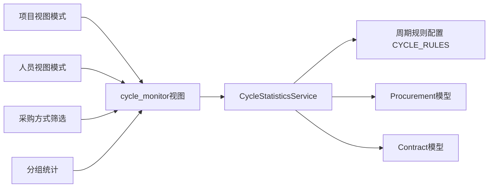
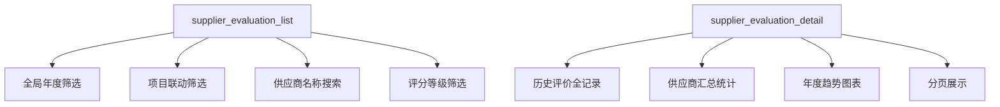

# 系统架构分析文档

## 文档信息

**文档版本：** v2.1
**更新日期：** 2025-11-13
**分析范围：** 系统分层架构、模块职责、数据模型、核心业务流程
**目标读者：** 开发人员、系统架构师、运维人员

---

## 1. 系统架构演进与现状

本系统已从最初的 **纯Django Admin后台** 模式，演进为 **“Admin后台 + 自定义前端页面”** 的混合架构模式。这一演进旨在兼顾快速开发与用户体验提升。

- **Admin后台**: 继续承担基础数据的增删改查 (CRUD) 和系统管理功能，由Django自动生成，开发效率高。
- **自定义前端页面**: 负责提供复杂的数据展示、交互式报表和定制化的业务流程，如数据监控驾驶舱、统计分析图表、高级筛选列表等，以提升用户体验。

### 1.1 架构设计原则

系统严格遵循以下软件工程原则，确保代码质量与可维护性：

- **KISS (Keep It Simple, Stupid)**: 优先选择最简单、直接的技术方案，如初期采用SQLite。
- **YAGNI (You Ain't Gonna Need It)**: 只实现当前明确需要的功能，避免过度设计。
- **DRY (Don't Repeat Yourself)**: 通过`BaseModel`等抽象基类和工具函数，消除代码重复。
- **SOLID**:
  - **单一职责**: 每个App专注于一个核心业务领域（如`contract`只管合同）。服务层函数（如`get_procurement_statistics`）也遵循此原则。
  - **开放/封闭**: 模块化设计允许在不修改核心代码的情况下增加新的App或监控页面。

---

## 2. 分层架构设计

系统采用经典的三层架构，并增加了独立的服务层，以实现业务逻辑与视图的解耦。

```mermaid
graph TD
    subgraph "用户访问层"
        A[用户浏览器]
    end

    subgraph "表现层 (Presentation Layer)"
        B[Django Admin]
        C[自定义前端页面<br>(HTML/CSS/JS)]
        D[Nginx/Web服务器<br>(生产环境)]
    end

    subgraph "应用层 (Application Layer)"
        E[URL路由<br>(config/urls.py)]
        F[视图编排<br>(project/views.py + views_*.py)]
        G[API接口<br>(DRF或自定义)]
    end

    subgraph "服务层 (Service Layer)"
        H[统计服务<br>(statistics.py)]
        I[监控服务<br>(archive_monitor.py, completeness.py)]
        J[报表服务<br>(report_generator.py)]
    end

    subgraph "数据与模型层 (Data & Model Layer)"
        K[Django ORM]
        L[业务模型<br>(models.py)]
    end

    subgraph "数据持久层 (Persistence Layer)"
        M[SQLite / PostgreSQL]
    end

    A --> D --> E
    E --> F
    F --> C
    F --> G
    F --> H
    F --> I
    F --> J
    H & I & J --> K
    K --> L
    L --> M
    B --> F
```

- **表现层**: 包括Django Admin自动生成的后台和位于 `project/templates` 的自定义HTML模板。负责用户界面的渲染。
- **应用层**: `config/urls.py` 定义了所有URL端点，`project/views.py` 目前只保留视图聚合与装饰器封装的职责，具体业务视图拆分到 `views_projects.py`、`views_procurements.py`、`views_contracts.py`、`views_payments.py` 等模块内，分别负责调用服务、处理数据并响应请求。
- **服务层**: 位于 `project/services/` 目录，是业务逻辑的核心。将复杂的计算、统计和监控逻辑从视图中剥离，形成可复用、可测试的独立服务。
- **数据与模型层**: 定义了所有业务实体 (`models.py`) 及其关系，通过Django ORM与数据库交互。
- **数据持久层**: 当前使用SQLite，未来可平滑迁移至PostgreSQL等更强大的数据库。

### 2.1 视图模块拆分

为严格遵循SRP、DRY与SOLID原则，同时保持KISS与YAGNI的平衡，`project/views.py` 仅负责统一注册URL、共享装饰器和跨模块编排，视图实现按业务域拆分到若干 `views_*.py` 文件中：

| 模块 | 作用 | 说明 |
| :--- | :--- | :--- |
| `views.py` | 统一导出视图、封装鉴权/事务处理、协调多模块组合 | 保持入口清晰，方便在URL层集中管理 |
| `views_helpers.py` | 公共过滤、分页、查询参数解析等辅助函数 | 消除重复逻辑，方便其他视图按需调用 |
| `views_projects.py` | 仪表盘、项目列表与详情视图 | 提供跨业务综述数据，便于扩展更多项目维度 |
| `views_procurements.py` | 采购业务视图（列表、详情、过滤） | 专注采购领域，便于引入新筛选项 |
| `views_contracts.py` | 合同视图与批量操作（导入、刷新） | 支持复杂表单校验，降低对其他模块的影响 |
| `views_payments.py` | 付款与结算视图 | 将付款/结算口径统一，方便统计复用 |
| `views_monitoring.py` | 档案归档、监控面板相关视图 | 覆盖档案汇总、摘要、记录等多个模板 |
| `views_statistics.py` | 统计分析与图表数据接口 | 统一输出JSON/CSV统计，复用services.statistics |
| `views_reports.py` | 报表导出/下载视图 | 面向Word/Excel/CSV等格式的生成逻辑 |
| `views_ops.py` | 数据导入、批量删除、防护性运维入口 | 集中处理高风险操作并加入审计提示 |
| `views_api.py` | JSON API、前端异步接口 | 为前端组件提供轻量数据通道，解耦模板渲染 |

拆分后的模块均通过 `config/urls.py` 显式路由至对应函数，保证引入新业务或重构旧逻辑时，只需扩展相应 `views_xxx.py` 文件即可，避免对全局入口造成破坏性修改，也使代码审查和测试边界更加清晰。

---

## 3. 模块职责与依赖关系

系统按业务领域划分为多个独立的Django App，并通过 `project` App 提供核心的共享功能和页面。

### 3.1 模块依赖图

```mermaid
graph TD
    subgraph "核心业务App"
        A[project<br>(项目管理, 核心视图)]
        B[procurement<br>(采购管理)]
        C[contract<br>(合同管理)]
        D[payment<br>(付款管理)]
        E[settlement<br>(结算管理)]
        F[supplier_eval<br>(供应商评价)]
    end

    subgraph "配置与入口"
        G[config<br>(settings.py, urls.py)]
    end

    G --> A
    A --> B
    A --> C
    A --> D
    A --> E
    A --> F

    B --> C
    C --> D
    C --> E
    C --> F
```

### 3.2 模块职责划分

| 模块 (`App`) | 核心职责 | 关键模型 | 主要依赖 |
| :--- | :--- | :--- | :--- |
| **`config`** | 全局配置与路由 | - | 所有App |
| **`project`** | 项目主数据、核心视图、API、服务层、模板 | `Project` | 所有App |
| **`procurement`** | 采购流程管理 | `Procurement` | `project` |
| **`contract`** | 合同与补充协议管理 | `Contract` | `project`, `procurement` |
| **`payment`** | 付款记录与结算标记 | `Payment` | `contract` |
| **`settlement`** | 结算数据管理 | `Settlement` | `contract` |
| **`supplier_eval`** | 供应商履约评价 | `SupplierEvaluation` | `contract` |

- **`project` App 的核心地位**: `project` App 不仅是一个业务模块，更是整个系统的“主应用”。它承载了所有自定义前端页面的视图、API接口、核心服务以及共享的模板和静态文件，是连接所有其他业务模块的枢纽。

---

## 4. 数据模型架构

数据模型是系统的基石，定义了业务实体及其关系。

- **核心关联**: 以 `Project` -> `Procurement` -> `Contract` -> `Payment` / `Settlement` 为主线，构成了完整的业务数据链。
- **自关联**: `Contract` 模型通过 `parent_contract` 字段实现了主合同与补充协议的父子关系。
- **外键保护**: 关键外键均设置为 `on_delete=models.PROTECT`，防止因误删上游数据而导致下游数据成为孤岛，保障了数据的完整性。
- **抽象基类**: 所有模型继承自 `procurement.models.BaseModel`，自动获得 `created_at`, `updated_at` 等审计字段。

*(详细的ER图和字段说明请参考 [数据模型使用手册](数据模型使用手册.md))*

---

## 5. 部署架构

系统设计为在局域网内部署，配置简单，运维成本低。

```mermaid
graph TD
    subgraph "用户端"
        User1[系统管理员]
        User2[数据管理员]
    end

    subgraph "服务器 (Windows/Linux)"
        subgraph "Python 环境"
            Django[Django应用<br>(runserver_plus HTTPS)]
        end
        subgraph "数据存储"
            SQLite[db.sqlite3]
            Backup[备份目录]
        end
        Firewall[防火墙<br>(开放端口3500)]
    end

    User1 & User2 -- HTTP --> Firewall -- 端口转发 --> Django
    Django <--> SQLite
    Django -- 定时任务 --> Backup
```

- **服务器**: 一台普通的PC或服务器即可。
- **运行方式**: 通过 `start_server.bat` 启动HTTPS服务（使用 `runserver_plus 0.0.0.0:3500`），监听局域网内的所有IP请求。
- **数据库**: 使用单个 `db.sqlite3` 文件，备份简单，只需复制文件即可。
- **网络**: 需要在服务器防火墙上开放 `3500` 端口。
- **安全**: 使用自签名SSL证书提供HTTPS加密传输。

---

## 6. 最新功能架构设计

### 6.1 工作周期监控系统架构

#### 6.1.1 功能概述

工作周期监控系统是对原有监控体系的重要补充，专门用于跟踪和评估采购与合同业务的工作周期效率。系统通过计算实际周期与规定周期的偏差，实现流程效率的量化管理。

#### 6.1.2 架构组件



#### 6.1.3 服务层设计

`CycleStatisticsService`类采用**单一职责原则（SRP）**，专门负责周期相关的数据统计：

- **项目维度统计**: 按项目汇总采购周期和合同周期
- **人员维度统计**: 按经办人统计周期表现
- **详细数据查询**: 支持查看单个项目或人员的周期明细
- **趋势分析**: 提供周期变化的趋势数据

#### 6.1.4 周期规则配置

系统采用配置化的周期管理，通过`CYCLE_RULES`集中管理：

```python
# 采购周期规则（可配置）
procurement_rules = {
    'start_field': 'requirement_approval_date',
    'end_field': 'result_publicity_release_date',
    'deadline_map': {  # 按采购方式的规定周期
        '直接采购': 15,
        '公开招标': 45,
        '竞争性谈判': 35,
        # ... 其他方式
    },
    'default_deadline': 45
}

# 合同周期规则（统一管理）
contract_rules = {
    'start_field': 'procurement__result_publicity_release_date',
    'end_field': 'signing_date',
    'deadline_days': 15  # 统一15天
}
```

**设计优势**:
- 遵循**开放封闭原则（OCP）**：新增采购方式时无需修改代码
- 集中管理便于维护：修改周期规则只需更新配置文件
- 支持差异化周期：不同采购方式可以有不同的规定周期

### 6.2 供应商评价系统架构重构

#### 6.2.1 重构概述

供应商评价系统经历了重大架构升级，从简单的列表展示演进为支持全局筛选、智能分组、趋势分析的完整评价体系。

#### 6.2.2 视图架构优化

**重构前问题**:
- 无法根据年度筛选评价数据
- 缺乏全局视图和项目联动
- 评价详情无法追溯

**重构后方案**:



#### 6.2.3 数据获取逻辑优化

**智能数据筛选**:
```python
# 全部年度：获取每个供应商最新评价
if year_filter is None:
    latest_evaluations = SupplierAnalysisService.get_latest_evaluations_by_year(None)

# 特定年度：获取该年度所有评价
else:
    year_evaluations = SupplierEvaluation.objects.filter(created_at__year=year_filter)
```

**评分等级分类**:
- `excellent`: 综合评分 ≥ 90（优秀）
- `good`: 80 ≤ 综合评分 < 90（良好）
- `qualified`: 70 ≤ 综合评分 < 80（合格）
- `unqualified`: 综合评分 < 70（不合格）

#### 6.2.4 详情页面设计

新增的详情页面`supplier_evaluation_detail`提供：

- **全景视图**: 供应商所有合同的完整评价历史
- **趋势分析**: 历年评分变化趋势图表
- **汇总统计**: 合同数、总金额、平均评分等关键指标
- **分页浏览**: 支持大量历史数据的分页查看

### 6.3 新架构优势分析

| 方面 | 传统方案 | 新架构方案 | 优势 |
|------|----------|------------|------|
| **周期管理** | 人工计算、无法追溯 | 自动计算、配置化管理 | 提高准确性、支持灵活调整 |
| **评价查看** | 单次评价展示 | 年度全景+历史详情 | 更全面、更灵活的数据洞察 |
| **系统扩展** | 硬编码规则 | 配置化+服务层 | 遵循OCP，易于维护和扩展 |
| **用户体验** | 筛选功能单一 | 多维度联动筛选 | 更智能、更高效的数据查找 |

### 6.4 架构设计原则体现

#### 6.4.1 SOLID原则应用

- **S（单一职责）**:
  - `CycleStatisticsService`只负责周期统计
  - `SupplierAnalysisService`只负责评价分析
  - 各视图函数职责明确

- **O（开放封闭）**:
  - 周期规则通过配置扩展，无需修改核心代码
  - 新增评价维度只需扩展服务层方法

- **L（里氏替换）**:
  - 服务层方法可以替换实现而不影响调用方

- **I（接口隔离）**:
  - 不同视图调用不同的服务方法，避免冗余

- **D（依赖倒置）**:
  - 视图层依赖服务抽象，而非具体实现

#### 6.4.2 KISS & YAGNI原则

- **简单至上**: 避免复杂的周期计算框架，使用直接的日期差值计算
- **精益求精**: 只实现当前需要的周期监控和评价功能，未过度设计未来可能的需求

#### 6.4.3 DRY原则

- 通过服务层抽象消除视图中的重复逻辑
- 周期规则集中配置，避免多处定义

---

## 7. 架构评估与展望

### 7.1 优势

- **快速开发**: 基于Django和Admin后台，能快速响应业务需求。
- **易于维护**: 模块化设计和清晰的分层使得代码易于理解和修改。
- **低成本部署**: 对硬件要求低，无需复杂的数据库和Web服务器配置。
- **灵活扩展**: "Admin+自定义页面"的混合模式兼顾了开发效率和用户体验，服务层的设计也为未来构建更复杂的前端应用（如Vue/React）打下了良好基础。

### 7.2 潜在风险与演进方向

| 风险/瓶颈 | 风险等级 | 演进建议 |
| :--- | :--- | :--- |
| **SQLite并发性能** | 中 | 当并发用户增多或数据量巨大时，可能出现数据库锁定。**建议**：迁移到 `PostgreSQL`。 |
| **单体应用** | 低 | 当前数据量和业务复杂度下不是问题。**建议**：未来可按服务层逻辑拆分为微服务。 |
| **前端体验** | 低 | 自定义页面已缓解部分问题，但非SPA。**建议**：引入Vue或React重构前端，打造单页应用（SPA）。 |
| **部署方式** | 中 | `runserver_plus` 适合内网开发环境。**建议**：生产环境采用 `Gunicorn/uWSGI + Nginx` 的标准部署方案。 |

---
**文档状态：** ✅ 完成
**维护责任人：** 系统架构师
**相关文档：** [数据模型使用手册](数据模型使用手册.md), [开发实践指南](开发实践指南.md)