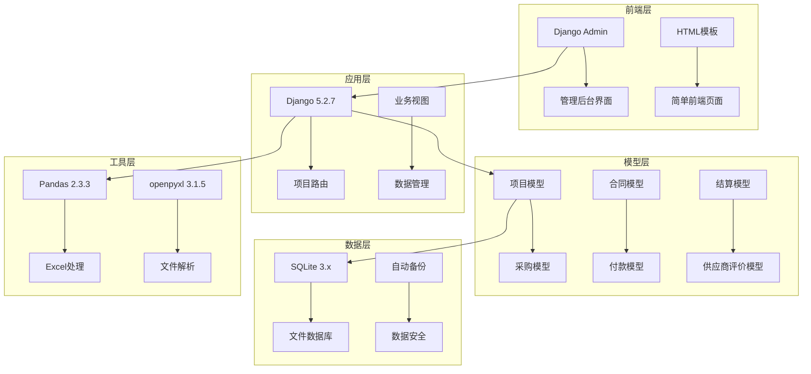
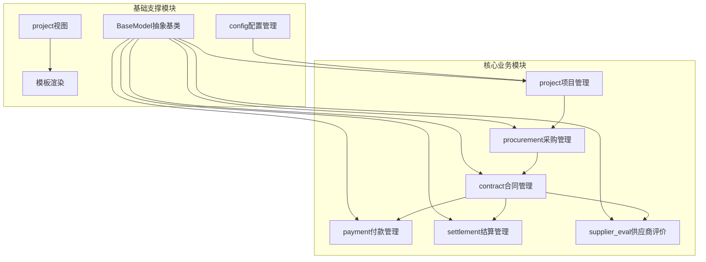
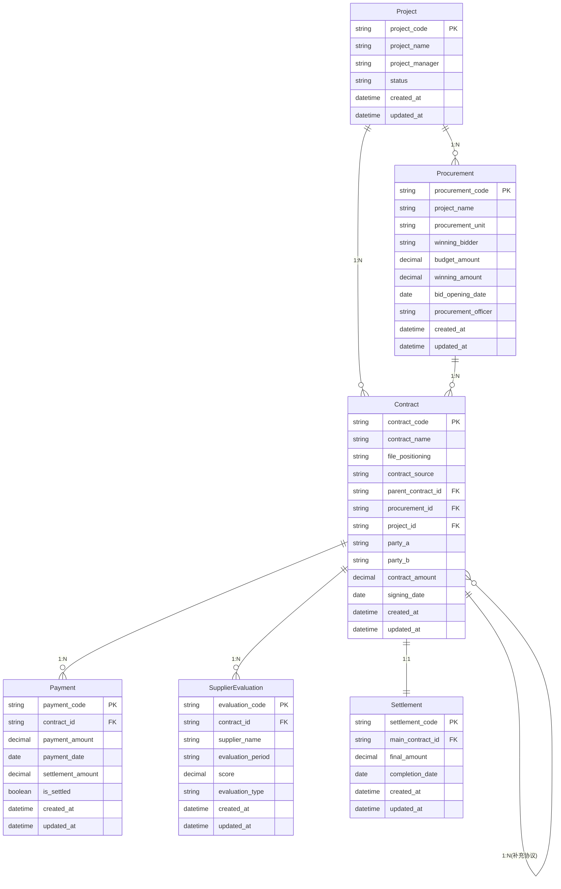
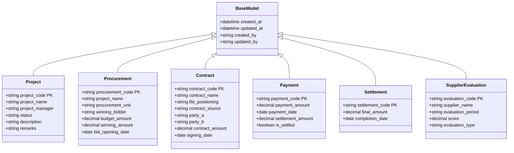
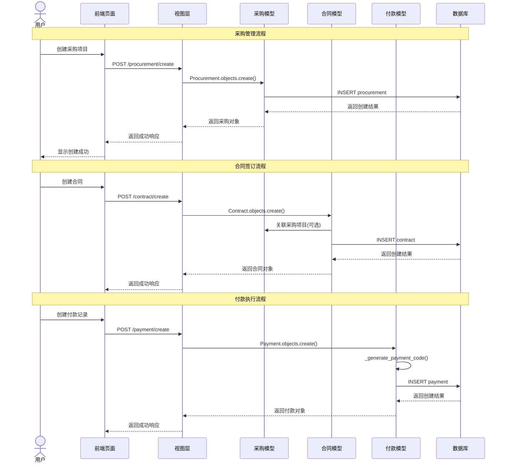
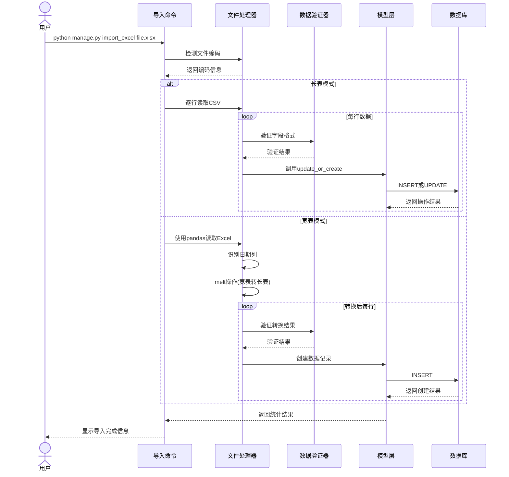
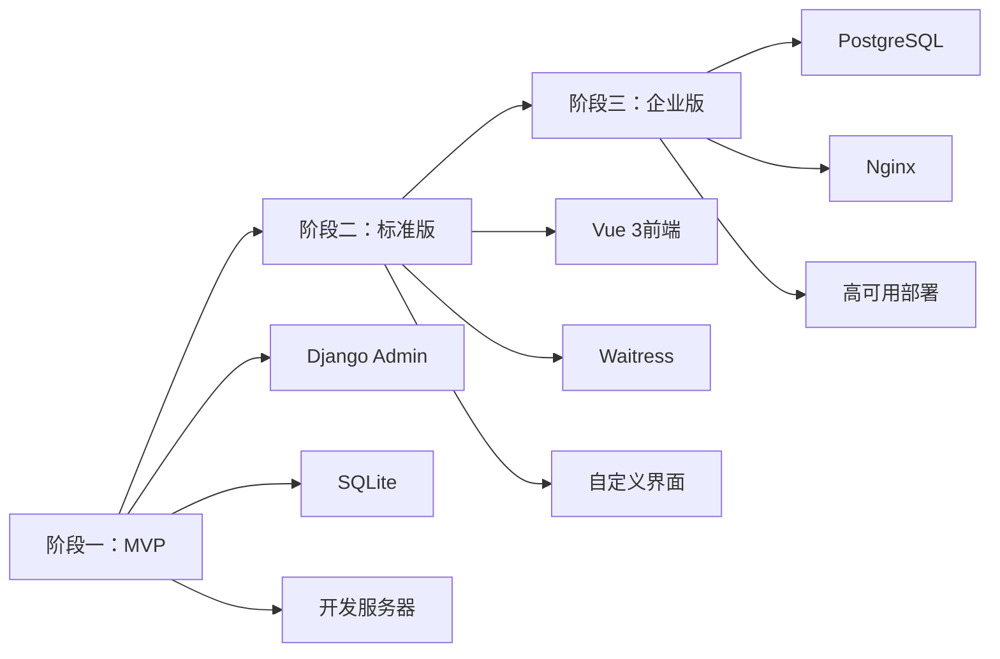

# 项目采购与成本管理系统 - 系统架构分析文档

## 文档信息

**文档版本：** v1.0  
**创建日期：** 2025-10-21  
**分析范围：** 全系统架构、数据模型、业务流程  
**分析方法：** 代码解构与业务分析  

---

## 1. 系统概述

### 1.1 系统定位

项目采购与成本管理系统是一套部署在公司内部局域网的轻量级数据管理平台，专注于将分散在多个Excel文件中的采购、合同、付款、结算及供应商评价数据进行集中化、结构化管理。

### 1.2 核心价值

- ✅ **数据集中化**：消除Excel分散管理的痛点
- ✅ **业务流程化**：建立采购→合同→付款→结算的完整链条
- ✅ **查询便捷化**：提供多维度、穿透式数据查询能力
- ✅ **导入智能化**：支持长表和宽表两种历史数据格式

### 1.3 技术定位

采用**渐进式技术方案**，从最简单的Django Admin + SQLite开始，根据实际需要逐步升级。当前为MVP阶段，专注功能实现而非技术复杂性。

---

## 2. 技术架构全景

### 2.1 技术栈选择



### 2.2 架构设计原则

| 原则 | 体现 | 说明 |
|------|------|------|
| **KISS（简单至上）** | Django Admin + SQLite | 选择最简单可行的技术方案 |
| **YAGNI（你不需要它）** | 功能最小化 | 只实现当前明确需要的功能 |
| **DRY（杜绝重复）** | BaseModel抽象类 | 提取通用的审计字段 |
| **SOLID（坚实基础）** | 模型单一职责 | 每个模型专注于特定业务领域 |

### 2.3 部署架构

```
局域网环境 (192.168.x.x)
├── 用户浏览器
│   ├── 系统管理员 (1人)
│   └── 模块数据管理员 (部门负责人)
└── 应用服务器 (Windows Server/PC)
    ├── Django开发服务器 (0.0.0.0:8000)
    ├── SQLite数据库文件
    └── 定时备份任务
```

---

## 3. 模块架构分析

### 3.1 模块依赖关系



### 3.2 模块职责划分

| 模块 | 核心职责 | 关键类 | 外部依赖 |
|------|----------|--------|----------|
| **project** | 项目信息管理，作为业务数据的组织容器 | `Project` | 无 |
| **procurement** | 采购全生命周期管理，从需求到中标 | `Procurement` | Project |
| **contract** | 合同信息管理，支持主合同和补充协议 | `Contract` | Project, Procurement |
| **payment** | 付款记录管理，支持结算标记 | `Payment` | Contract |
| **settlement** | 结算信息管理，一对一关联主合同 | `Settlement` | Contract |
| **supplier_eval** | 供应商履约评价管理 | `SupplierEvaluation` | Contract |

---

## 4. 数据模型架构

### 4.1 核心数据关系



### 4.2 继承体系设计



---

## 5. 核心业务流程时序图

### 5.1 采购到付款完整流程



### 5.2 Excel数据导入流程



---

## 6. 关键设计模式分析

### 6.1 抽象基类模式 (Template Method)

**位置：** [`procurement/models.py:BaseModel`](procurement/models.py:8)

**设计意图：** 提取所有业务模型的通用审计字段，避免代码重复

```python
class BaseModel(models.Model):
    created_at = models.DateTimeField('创建时间', auto_now_add=True)
    updated_at = models.DateTimeField('更新时间', auto_now=True)
    created_by = models.CharField('创建人', max_length=50, blank=True)
    updated_by = models.CharField('更新人', max_length=50, blank=True)
    
    class Meta:
        abstract = True  # 抽象基类，不创建数据库表
        ordering = ['-created_at']
```

**优势分析：**
- ✅ **DRY原则**：消除重复的审计字段定义
- ✅ **一致性**：确保所有模型都有相同的时间戳字段
- ✅ **可维护性**：修改审计逻辑只需在一处进行

### 6.2 策略模式 (Strategy Pattern)

**位置：** [`procurement/management/commands/import_excel.py`](procurement/management/commands/import_excel.py:24)

**设计意图：** 支持多种数据导入策略（长表、宽表）

```python
class Command(BaseCommand):
    def handle(self, *args, **options):
        mode = options['mode']  # long 或 wide
        if mode == 'long':
            self._handle_long_table(...)
        else:
            self._handle_wide_table(...)
```

**优势分析：**
- ✅ **开闭原则**：对扩展开放，可轻松添加新的导入模式
- ✅ **单一职责**：每种导入模式有独立的处理逻辑
- ✅ **用户友好**：通过命令行参数选择策略

### 6.3 工厂方法模式 (Factory Method)

**位置：** [`payment/models.py:Payment._generate_payment_code()`](payment/models.py:78)

**设计意图：** 自动生成付款编号，封装编号生成逻辑

```python
def _generate_payment_code(self):
    """生成付款编号：合同序号-FK-序号"""
    contract_identifier = self.contract.contract_sequence or self.contract.contract_code
    # 复杂的序号计算逻辑...
    return f"{contract_identifier}-FK-{sequence:03d}"
```

**优势分析：**
- ✅ **封装复杂性**：隐藏编号生成的复杂逻辑
- ✅ **一致性**：确保所有付款编号格式统一
- ✅ **可维护性**：修改编号规则只需修改一处

---

## 7. 数据完整性保障机制

### 7.1 外键约束策略

| 关系类型 | 约束方式 | 保护机制 | 业务含义 |
|---------|----------|----------|----------|
| Project → Procurement | `models.PROTECT` | 禁止删除有采购的项目 | 保护项目数据完整性 |
| Procurement → Contract | `models.PROTECT` | 禁止删除有合同的采购 | 保护采购数据完整性 |
| Contract → Payment | `models.PROTECT` | 禁止删除有付款的合同 | 保护合同数据完整性 |
| Contract → Settlement | `models.OneToOne` | 一对一强制约束 | 确保结算唯一性 |

### 7.2 业务规则验证

**位置：** [`contract/models.py:Contract.clean()`](contract/models.py:182)

```python
def clean(self):
    """业务规则验证"""
    errors = {}
    
    # 规则1: 补充协议必须关联主合同
    if self.file_positioning == '补充协议' and not self.parent_contract:
        errors['parent_contract'] = '补充协议必须关联主合同'
    
    # 规则2: 采购合同必须关联采购项目
    if self.contract_source == '采购合同' and not self.procurement:
        errors['procurement'] = '采购合同必须关联采购项目'
    
    if errors:
        raise ValidationError(errors)
```

**验证时机：**
- ✅ **保存前验证**：`save()`方法调用`full_clean()`
- ✅ **Admin验证**：Django Admin自动调用验证
- ✅ **导入验证**：数据导入时进行批量验证

---

## 8. 性能优化策略

### 8.1 数据库查询优化

**位置：** [`project/views.py:contract_list()`](project/views.py:202)

```python
# 使用select_related减少数据库查询
contracts = Contract.objects.select_related('project')

# 使用prefetch_related优化反向关系
contracts = Contract.objects.prefetch_related('payments', 'evaluations')

# 添加数据库索引
class Contract(models.Model):
    signing_date = models.DateField(db_index=True)  # 添加索引
```

### 8.2 分页查询策略

```python
# 分页处理，避免一次性加载过多数据
paginator = Paginator(contract_data, page_size)
page_obj = paginator.get_page(page)
```

### 8.3 批量操作优化

**位置：** [`procurement/management/commands/import_excel.py`](procurement/management/commands/import_excel.py:252)

```python
# 使用事务确保批量操作的原子性
with transaction.atomic():
    result = self._import_long_row(row, module, conflict_mode)
```

---

## 9. 安全性设计

### 9.1 数据访问控制

- ✅ **Admin权限控制**：基于Django Admin的用户权限系统
- ✅ **操作审计**：所有模型包含创建人、更新人字段
- ✅ **数据保护**：敏感操作需要确认（如删除数据）

### 9.2 输入验证机制

```python
# 文件类型验证
if not uploaded_file.name.endswith('.csv'):
    return JsonResponse({'success': False, 'message': '只支持CSV文件格式'})

# 数据格式验证
payment_amount = self._parse_decimal(row.get('实付金额(元)'))
if payment_amount is None:
    raise ValueError('实付金额不能为空')
```

---

## 10. 可扩展性设计

### 10.1 模块化架构

每个业务模块独立设计，支持：
- ✅ **独立开发**：每个模块可独立开发和测试
- ✅ **独立部署**：模块之间松耦合，便于扩展
- ✅ **独立维护**：修改一个模块不影响其他模块

### 10.2 渐进式升级路径



---

## 11. 系统边界与集成点

### 11.1 内部集成

| 集成点 | 集成方式 | 数据流向 | 说明 |
|--------|----------|----------|------|
| 采购→合同 | 外键关联 | 1:N | 一个采购可对应多个合同 |
| 合同→付款 | 外键关联 | 1:N | 一个合同可有多笔付款 |
| 合同→结算 | OneToOne | 1:1 | 主合同只能有一条结算记录 |

### 11.2 外部集成

| 外部系统 | 集成方式 | 数据格式 | 用途 |
|----------|----------|----------|------|
| Excel文件 | 文件导入 | CSV/Excel | 历史数据迁移 |
| OA系统 | 手动录入 | 文本 | 采购需求审批日期 |
| 阳光采购平台 | 手动录入 | 文本 | 中标结果公示信息 |

---

## 12. 监控与运维

### 12.1 日志记录

```python
import logging
logger = logging.getLogger(__name__)

# 记录导入过程
logger.info(f'开始导入文件: {file_path}')
logger.error(f'导入失败: {str(e)}')
```

### 12.2 数据备份策略

**位置：** [`backup_db.py`](scripts/backup_db.py)

```python
def backup_database():
    """备份SQLite数据库"""
    timestamp = datetime.datetime.now().strftime('%Y%m%d_%H%M%S')
    backup_file = os.path.join(backup_dir, f'db_backup_{timestamp}.sqlite3')
    shutil.copy2(source, backup_file)
```

### 12.3 健康检查

- ✅ **数据库连接检查**：验证SQLite数据库可访问性
- ✅ **磁盘空间检查**：确保有足够空间进行备份
- ✅ **数据一致性检查**：定期验证外键关系完整性

---

## 13. 架构评估与建议

### 13.1 架构优势

| 优势 | 具体体现 | 业务价值 |
|------|----------|----------|
| **简单性** | Django Admin + SQLite | 快速上线，学习成本低 |
| **可靠性** | 事务保护 + 外键约束 | 数据一致性强 |
| **可维护性** | 模块化设计 + 清晰分层 | 易于理解和修改 |
| **可扩展性** | 渐进式升级路径 | 支持业务增长需求 |

### 13.2 潜在风险

| 风险 | 风险等级 | 缓解措施 |
|------|----------|----------|
| **SQLite并发限制** | 中等 | 后期可升级到PostgreSQL |
| **Admin界面限制** | 低 | 后期可添加Vue前端 |
| **数据量增长** | 低 | 预留升级路径和性能优化空间 |

### 13.3 改进建议

1. **短期改进（1-3个月）**
   - 添加数据导出功能
   - 优化批量导入性能
   - 增强数据验证规则

2. **中期改进（3-6个月）**
   - 添加自定义前端界面
   - 实现数据统计分析功能
   - 增加用户权限细分

3. **长期改进（6个月以上）**
   - 升级到PostgreSQL数据库
   - 实现高可用部署
   - 添加API接口支持

---

## 14. 总结

本系统采用**渐进式架构设计**，以最简单的技术方案满足当前业务需求，同时预留清晰的升级路径。核心特点包括：

### 14.1 架构亮点

- ✅ **业务驱动**：架构设计紧密围绕采购管理业务流程
- ✅ **数据完整**：通过外键约束和业务规则确保数据质量
- ✅ **导入智能**：支持长表和宽表两种历史数据格式
- ✅ **扩展友好**：模块化设计支持渐进式功能扩展

### 14.2 技术决策合理性

| 决策 | 理由 | 效果 |
|------|------|------|
| Django Admin | 快速实现管理界面 | 2周内完成MVP |
| SQLite | 零配置，易维护 | 降低运维复杂度 |
| BaseModel | 消除代码重复 | 提高代码质量 |
| 宽表转长表 | 解决历史数据问题 | 降低数据迁移成本 |

### 14.3 业务价值实现

通过合理的架构设计，系统成功实现了：
- 🎯 **数据集中化管理**：消除Excel分散管理痛点
- 🎯 **业务流程标准化**：建立采购→合同→付款完整链条
- 🎯 **历史数据平滑迁移**：智能转换功能降低迁移成本
- 🎯 **查询效率提升**：多维度、穿透式数据查询能力

---

**文档状态：** ✅ 完成  
**审核状态：** 待审核  
**下一步：** 根据审核反馈调整架构设计